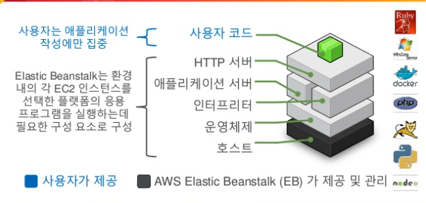

## Elastic Beanstalk 란

Elastic Beanstalk 은 웹 애플리케이션/웹 서비스를 배포하고 확장하고 관리하는데 있어 쉽고 빠르게 할 수 있도록 돕는 Fully Managed Service 다.

코드만 올리면 알아서 스케일링과 배포 같은 작업을 알아서 해주는 편리한 서비스다.

하지만 편리한 서비스의 이면에는 항상 함정이 숨어 있다. 우선 왜 EBS(Elastic Beanstalk)가 등장했는지 알아보자

## Elastic Beanstalk 등장 배경

개발자들은 비즈니스 로직과 기능을 코드로 구현을 한다. 그리고 우리는 그 외의 작업도 해야한다.

코드의 배포 (배포 자동화), 프로비저닝, 네트워크 및 방화벽 구성, 로드밸런싱, 오토스케일링 등 여러 작업에 우리는 많은 비용을 지출해야 한다.

근대 시대의 흐름이 온프레미스에서 클라우드 환경으로 넘어가면서, 한결 이 작업은 간편해졌다. 하지만 이마저도 러닝 커브와 설정에 대한 비용이 있다.

간단히 서비스를 만들어서 시장 반응성을 보려할 때도 이러한 설정들을 해줘야 할까? 이것도 부담이 만만치 않을 것이다.

Elastic Beanstalk 은 위에서 언급한, 프로비저닝, 배포, 로드밸런싱 등 모든 과정을 한 번에 관리해주어서 Infra 에 대한 프로비저닝, 업데이트 및 배포 등을 신경쓰지 않고 기능 개발에만 집중할 수 있게 된다.

과금 체계 또한 빈스톡에 대한 추가 비용은 없고 자기가 사용한 AWS EC2, S3 에 대한 비용만 지불하면 된다.

## 관리 포인트

AWS Elastic Beanstalk 이 지원하는 기술은 다음과 같다.

- 인스턴스 및 OS 설치
- 웹어플리케이션 소프트웨어 구성
- Auto Scaling 구성
- 로드 밸런서 구성
- 업데이트 배포 및 버전 고나리
- 모니터링

## 사용 자원

Elastic Beanstalk 이 관리하며 사용하는 자원에 대해 알아보자.

- EC2 인스턴스
- Auto-Scaling Group
- Elastic Load Balancer
- Dns publising
- S3: 소스코드 관리

> 위에서도 언급했지만 우리는 위 자원을 사용한 것에 대한 비용만 내면 된다.

> 애플리케이션의 로그와 버전에 관한 설정들은 S3 에서 관리한다.

## 인프라 스택 구성

위 사진을 보면, 사용자는 코드만 올리면 된다. 애플리케이션 작성에만 집중할 수 있는 것이다.

## References

https://yonguri.tistory.com/35

https://www.slideshare.net/awskorea/aws-elastic-beanstalk-aws-aws-devday2018
