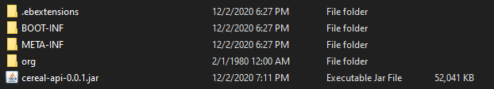

## .ebextensions

은 .ebextensions 폴더다. 프로젝트의 루트 경로에 해당 폴더를 만들고 하위에 config 파일을 작성해서 Elastic Beanstalk 의 Configuration 을 설정할 수 있다.

Elastic Loadbalancer, Health check, Https, Environment variable 등 다양한 것을 세부 조정할 수 있다.

## .ebextensions 내 config 작성법

적용 순서는 알파벳 순서이므로 앞에 01, 02 같은 숫자를 붙여도 좋다.

any_name.config 형태의 파일을 생성하고 내부에는 YAML Format 으로 작성하면 된다.

## 주의할 점

.ebextensions

## .ebextensions with Spring Boot

Spring Boot 를 사용할 때 나오는 .jar 파일 안에 .ebextensions 폴더를 함께 압축해야 한다.

### Java + build.gradle 를 사용한다면

build.gradle 에 다음 코드를 추가해주자.

```gradle
bootJar {
     from('.ebextensions') {
        into('.ebextensions' )
     }
}
```

혹은 다음도 가능하다.

```gradle
jar {
     from('.ebextensions') {
        into('.ebextensions')
    }
}
```

### Koltin + build.gradle.kts 를 사용한다면

build.gradle.kts 에 다음 코드를 추가해주자.

```gradle
import org.springframework.boot.gradle.tasks.bundling.BootJar

...

tasks.getByName<BootJar>("bootJar") {
    from(".ebextensions") {
        into(".ebextensions")
    }
}
```

## 압축이 잘 되었는지 확인 하는 방법

```bash
jar xf jar-file [file 명]
```

압축을 해제해서 .ebextensions 폴더도 함께 나오는지 확인하자.



## References

https://medium.com/@luisacarrion/getting-to-know-and-love-aws-elastic-beanstalk-configuration-files-ebextensions-9a4502a26e3c

https://stackoverflow.com/questions/54175340/how-do-you-build-a-folder-into-the-jar-root-of-a-spring-boot-gradle-project

https://docs.spring.io/spring-boot/docs/current/gradle-plugin/reference/htmlsingle/#packaging-executable-jars

https://stackoverflow.com/questions/39207803/clean-way-of-adding-ebextensions-to-spring-boot-jar-using-gradle

https://stackoverflow.com/questions/42861558/spring-boot-elastic-beanstalk-ebextensions-in-jar

https://docs.oracle.com/javase/tutorial/deployment/jar/unpack.html
