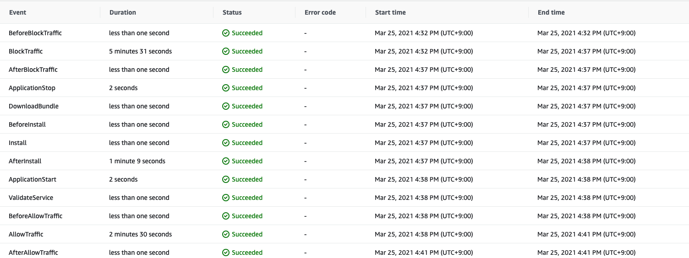
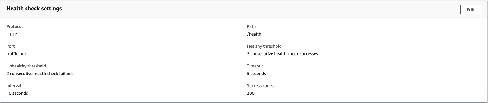
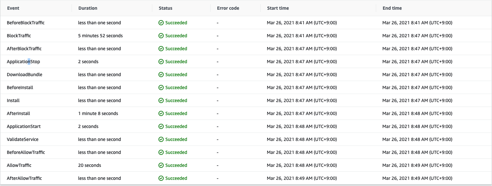
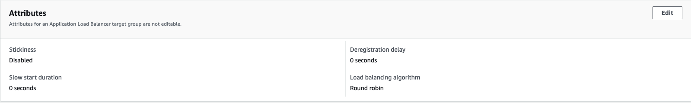
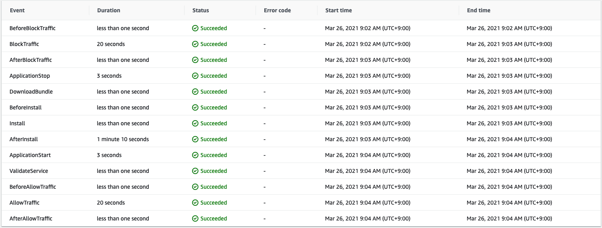

Codedeploy 로 배포를 하다보면 속도가 느려 속상할 때가 있습니다. 저도 이 문제를 해결하기 위해서 방법들을 찾아 보았습니다. 우선 일반적으로 속도 저하가 있는 대표적인 곳이 다음 두 가지입니다.

1. BlockTraffic
2. AllowTraffic

다음 사진에서도 확인해보시죠.

각각의 Event 에서 왜 속도가 저하가 되는지 알아봅시다.

## AllowTraffic

`AllowTraffic` Event 를 보면 2분 30초가 걸린 것을 볼 수 있습니다. 상당히 긴 시간을 차지하네요.

원인은, Target Group 에서 `Health Check` 할 때 오래 걸리기 때문입니다.

`AllowTraffic` 의 Default 설정 값을 살펴보면 `threshold` 는 5이고 `interval` 은 30입니다.

threshold 만큼 연속으로 Healthy 한지 검사하고 그 검사를 하는 간격이 30초라서, 30 \* 5 = 2분 30 초가 걸리는 것입니다.

속도를 빠르게 하기 위해선, 안전성을 조금 버리는 선택지로 `threshold` 와 `interval` 값을 줄이면 됩니다.

저는 다음과 같이 Healthy threshold 를 5에서 2로 변경하고 interval 도 30 에서 10으로 변경했습니다.

따라서 AllowTraffic 값이 20초로 바뀐 것을 볼 수 있습니다.

## BlockTraffic

CodeDeploy 의 속도가 느린 두 번째 이유로는 `BlockTraffic` 가 있습니다.

`BlockTraffic` 을 줄이기 위해서는 Deregistration delay 값을 낮추면 됩니다.

다음 사진과 같이 기본 300초에서 0으로 바꿔줍니다.

다음과 같이 바꾼 경우 바꿀 경우 `BlockTraffic` 에서의 소요 시간이 다음 사진과 같이 확연히 줄어든 것을 볼 수 있습니다.

## References

https://serverfault.com/questions/757262/is-there-a-way-to-speed-up-aws-codedeploy
