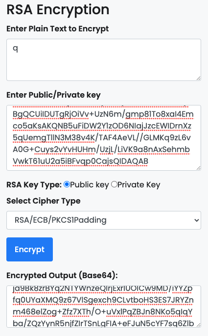

ECDSA (Elliptic Curve Digital Signature Algorithm) 은 타원 곡선 함수를 이용한 암호화 알고리즘으로 RSA 와 비슷한 기능을 제공한다.

Public Key 로 암호화해서 Private Key 의 소유자만이 복호화하게 하거나, Private Key 로 암호화해서 서명을 만들고 Public Key 로 검증할 수 있게 해준다.

ECDSA 는 Bitcoin 과 Ethereum 에서 사용된다.

## RSA vs ECDSA

- ECDSA 가 Signature, Public Key 길이가 더 짧다.
- ECDSA 가 성능 면에서 더 좋다.

RSA 는 기본적으로 Public Key 의 길이가 더 긴 데, 보안을 강화할 수록 키의 길이가 더욱 더 길어진다.

Mobile 이나 Emebedded System 과 같이 자원이 제한되거나 더 적은 네트워크 패킷을 요구하는 시스템에서는 더 ECDSA 가 어울리게 된다.

거기에 키의 길이도 작은 ECDSA 는 성능면에서도 더 우월하다고 한다.

## References

https://bitcoin.stackexchange.com/questions/21270/whats-the-rationale-of-using-ecdsa-instead-of-rsa

https://crypto.stackexchange.com/questions/3216/signatures-rsa-compared-to-ecdsa

https://gall.dcinside.com/mgallery/board/view/?id=blockchain&no=2691
