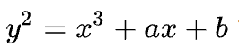
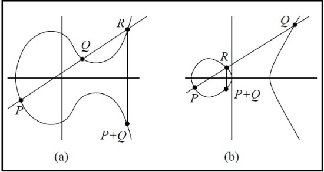
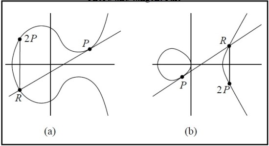
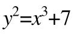

## ECDSA (Elliptic Curve Digital Signature Algorithm)

ECDSA 는 타원 곡선 암호를 전자 서명에 접목시킨 암호 알고리즘이다.

비트코인과 이더리움에서 ECDSA 를 SECP256K1 로 사용하고 있다.

개인키와 공개키가 한 쌍을 갖는다.

> ECC (Elliptic Curve Cryptography): 유한 필드에 대한 타원 곡선을 기반으로 하는 공개 키 암호화에 대한 접근 방식

## 디지털 서명

디저털 서명은 송신자에 의해 만들어진다. 디지털 서명으로 발신자를 확인하고 데이터 변조 여부를 확인할 수 있다.

부인 방지 (non-repudiation): 따라서 발신자가 메시지를 보내지 않았음을 부인할 수 없다.

무결성 (integrity): 메시지가 전송 중에 변경되지 않았다.

디지털 서명은 데이터를 해시한 값을 송신자의 비밀키로 암호화하는 것이다. 해시 알고리즘은 MD5, SHA-3 같은 것을 사용한다. (이더리움에서는 SHA3 를 사용한다.)

## 타원 곡선과 SECP256K1

### 타원 곡선 방정식

타원 곡선의 방정식은 다음과 같다.



### 점과 점의 덧셈



점 P와 점 Q를 더하는 방법은, 두 점을 지나는 직선을 긋고, 교점에서 x 축 대칭을 하면 나온 곳이 P+Q 점이다.

### 점에 상수를 곱하기



2P 즉, P 에 2라는 상수를 곱한다는 의미는 결국 P + P 이기 떄문에 P에 접선을 긋고 마찬가지로 더하기 과정을 진행하면 된다. 그렇다면 3P 도 2P + P 의 덧셈 과정을 진행하면 된다.

### SECP256K1

이더리움과 비트코인에서 사용하는 타원곡선 함수는 SECP256K1 이며 다음과 같다.



SECP256K1 은 a 가 0 이고 b 가 7 이며 기준점 G 가 "02 79BE667E F9DCBBAC 55A06295 CE870B07 029BFCDB 2DCE28D9 59F2815B 16F81798" 인 타원곡선이다.

## 서명을 보내고 검증하기

### 1. 비밀키를 만든다.

비밀키라는 것은 1 ~ n - 1 까지의 정수 중 하나다.

여기서 n 은 SECP256K1 타원곡선 하에서 1.157920892373162e+77 라는 값으로 정의되어 있는데 16진수로 표현하면 FFFFFFFFFFFFFFFFFFFFFFFFFFFFFFFEBAAEDCE6AF48A03BBFD25E8CD0364141 이다.

즉 개인키라는 것은 1 ~ FFFFFFFFFFFFFFFFFFFFFFFFFFFFFFFEBAAEDCE6AF48A03BBFD25E8CD0364141 사이의 값을 구하는 것이다.

이 범위를 벗어나면 이더리움에서는 올바르지 않은 개인 키라고 에러를 보낸다.

샘플 비밀키: 'FFFFFFFFFFFFFFFFFFFFFFFFFFFFFFFFFFFFFFFFFFFFFFFFFFFF201808180457'

> ECC 에서는 개인키를 구하고 공개키를 구하지만, RSA 에서는 공개키를 구하고 개인키를 구한다.

### 2. 서명 r 을 찾는다.

비밀키를 구할 때처럼 1 ~ n - 1 정수를 랜덤하게 고른다. 개인 키는 한 번 고르면 계속 그 키만 쓰는 반면, 이 값은 트랜잭션을 보낼 때마다 새로 구해야 한다. 이 값이 k 가 된다.

1. 임의의 값 k(20 bytes) 생성. 점의 곱셈을 이용해서 P = k x G 를 계산한다.
2. 점 P의 x 값이 r을 나타낸다. (20 bytes)

### 3. 서명 s 을 찾는다.

```text
`k^-1(z+r*private key) mod n`
```

- k: 위에서 구한 1 ~ n -1 의 랜덤한 값
- z: 트랜잭션 정보가 담긴 값
- r: 서명 r
- private key: 개인 키

이때 계산 값이 0이 나오면, 난수 K 를 새롭게 생성하고 다시 계산해야 한다.

**핵심: 서명 s 를 만들 때는 개인키가 들어가게 된다.**

### 4. 이제 거래를 전송하자.

내용을 담은 트랜잭션과 서명 r, s를 보내면 된다.

### 5. 검증하자

받는 사람은 아래 공식으로 검증을 할 수 있다.

```text
U1 * G + U2 * public key
```

```text
U1 = z * w mod n
U2 = r * w mod n
w = s^-1 mod n
```

public key는 공개 키이자 복구 키로 이더리움에서는 서명값이 아닌 정수 27 또는 28을 사용한다.

위 식은 타원곡선의 연산으로 결국 결과가 타원곡선 위의 점이 나오게 된다. 그리고 그 점의 x 좌표가 내가 받은 서명 r 과 같은지 비교하면 된다.

### 6. 공개키 구하기

위의 공개키를 구하는 방법을 알아보자.

공개키는 거래를 전송해주는 사람이 보내줄 수 있지만 이더리움에선 그렇게 하지 않는다. 원래 공개키라는 것은 복구키를 이용하면 구할 수 있다. 이더리움에서는 이 복구키를 27 혹은 28이라는 값으로 약속하자라고 해두었기 때문에 서명만을 가지고 복구키를 이용해 보낸 사람의 공개키를 추출할 수 있다.

정리하면, 트랜잭션에 있는 서명 v, r, s 에서 공개키를 추출할 수 있다. solidity 에서는 ecrecover 라는 함수가 있다.

## 개인키와 공개키와 주소

### 공개키

공개키는 개인키로부터 구할 수 있다. 비밀키와 이더리움에서 정한 기준 점 G 를 곱하면 된다.

위에서 말하기를 비밀키는 단순한 정수이므로 상수에 불과하고 점 G 는 타원 곡선 위의 점이므로 공개키도 타원 곡선위 점이라는 것을 알 수 있다.

공개키 = 비밀키 x G

### 주소

주소는 공개키로부터 구할 수 있다. 주소는 16진수로 공개키의 Keccak-256 해시의 마지막 20바이트를 구하면 된다.

```javascript
function publicKeyToAddress(pubKey: Buffer): Buffer {
  return keccak256(pubKey).slice(-20)
}
```

## References

https://brunch.co.kr/@nujabes403/13

http://blog.somi.me/math/2019/06/10/understanding-ECC-ECDSA/

http://www.yes24.com/Product/Goods/73165236

https://rosypark.tistory.com/108

https://perfectmoment.tistory.com/1231

http://wiki.hash.kr/index.php/%ED%83%80%EC%9B%90%EA%B3%A1%EC%84%A0_%EB%94%94%EC%A7%80%ED%84%B8%EC%84%9C%EB%AA%85_%EC%95%8C%EA%B3%A0%EB%A6%AC%EC%A6%98#cite_note-1
