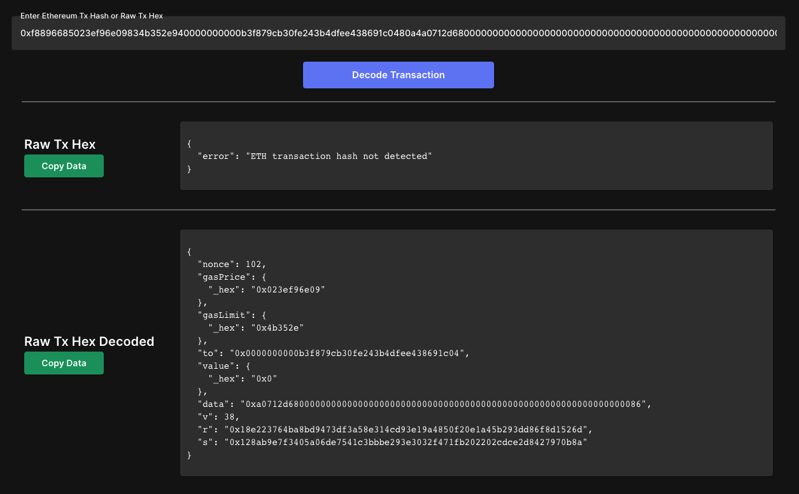
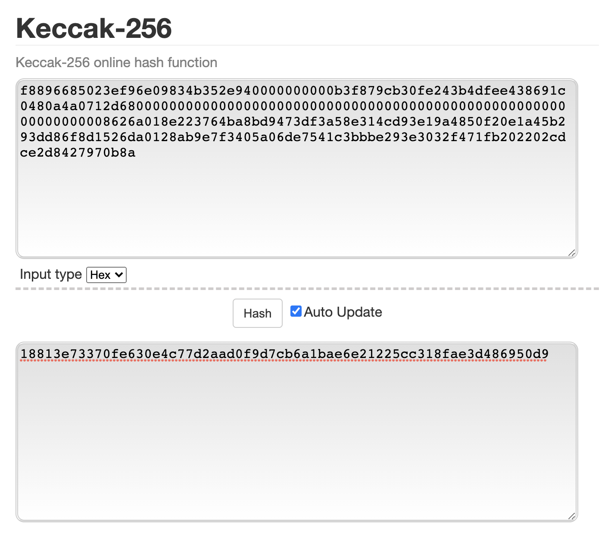
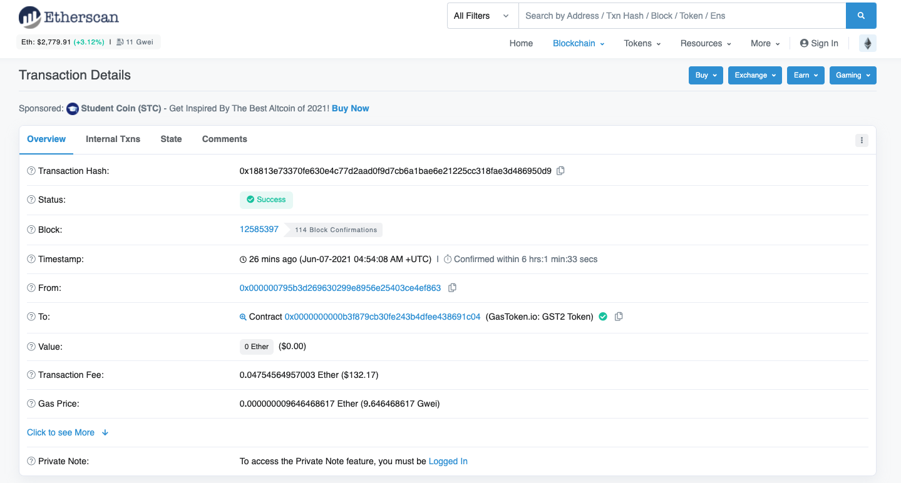

## 트랜잭션

트랜잭션은 다음 데이터를 포함한 시리얼라이즈된 바이너리 메시지다.

- 논스: 발신 EOA에 의해 발행되어 메시지 재사용을 방지하는 데 사용되는 일련번호
- 가스 가격(gas price): 발신자가 지급하는 가스의 가격(웨이)
- 가스 한도(gas limit): 이 트랜잭션을 위해 구입할 가스의 최대량
- 수신자(recipient): 목적지 이더리움 주소
- 값(value): 목적지에 보낼 이더의 양
- 데이터(data): 가변 길이 바이너리 데이터 페이로드
- v, r, s: EOA의 ECDSA 디지털 서명의 세 가지 구성요소

트랜잭션에는 from 이 포함되지 않고 to 만 있다. 그 이유는 v, r, s로부터 얻어낼 수 있기 때문이다.

Ecrecover를 하면 v, r, s 로부터 공개키를 얻을 수 있고, 공개로부터 주소를 얻을 수 있다. 이것을 ecrecover 라고 한다.

## 논스

tx를 만들 때의 논스는, 트랜잭션을 보내는 사람, 즉 sender의 transaction counter를 의미한다. 최초의 계정은 트랜잭션을 보낸 적이 없으므로 nonce 가 0이다.

nonce 값은 `getTransactionCount` 와 같은 RPC 요청을 통해 블록체인 노드에서 값을 가져올 수 있다.

## Transaction Hash

Transaction Hash 는 트랜잭션을 전송하기 전에도 미리 알 수 있다.

Transaction Hash는 거래소에서 TXID 라는 이름으로도 사용되며 해당 트랜잭션의 고유 ID 이다.

트랜잭션 해시는 rawTransaction 을 keccak256 해시 함수를 돌려서 얻을 수 있는 값이다.

그러면 rawTransaction 은 어떻게 구할까?

### rawTransaction

rawTransaction 은 트랜잭션 정보와 서명을 합친 것이다. 아래는 rawTransaction 이다. 이것을 디코딩하면 Transaction Data 가 들어있다.

'0xf8896685023ef96e09834b352e940000000000b3f879cb30fe243b4dfee438691c0480a4a0712d68000000000000000000000000000000000000000000000000000000000000008626a018e223764ba8bd9473df3a58e314cd93e19a4850f20e1a45b293dd86f8d1526da0128ab9e7f3405a06de7541c3bbbe293e3032f471fb202202cdce2d8427970b8a'

그리고 rawTransaction 을 Keccak-256 해싱을 하면 Transaction 의 고유한 ID인 Transaction Hash 를 얻을 수 있다.

위에서 구한 Transaction Hash 로 검색을 해서 확인할 수 있다. [링크](https://etherscan.io/tx/0x18813e73370fe630e4c77d2aad0f9d7cb6a1bae6e21225cc318fae3d486950d9)

### 트랜잭션을 미리 생성하기

3일 후에 원석이에게 0.01 이더를 보내주기로한 약속이 있다고 하자. 지금 바로 rawTransaction 을 미리 만들어서 3일 후에 전송할 수 있다.

rawTransaction 을 만들기 위해선 `signTransaction` 함수를 사용하면 된다. 그리고 3일 후에 `sendSignedTransaction` 함수를 사용해서 거래를 보내면 된다.

만약 약속이 취소되서 보내지 않기로 했다고 해보자. 그런데 rawTransaction 이 탈취당하면 어떻게 될까?

만약 해커가 탈취해서 그 rawTransaction 을 보내면 거래는 성사되게 된다. 왜냐면 그 rawTransaction 은 이미 서명과 거래 정보가 담긴 데이터이기 때문이다.

## References

https://brunch.co.kr/@nujabes403/15

https://www.ethereumdecoder.com

https://etherscan.io
