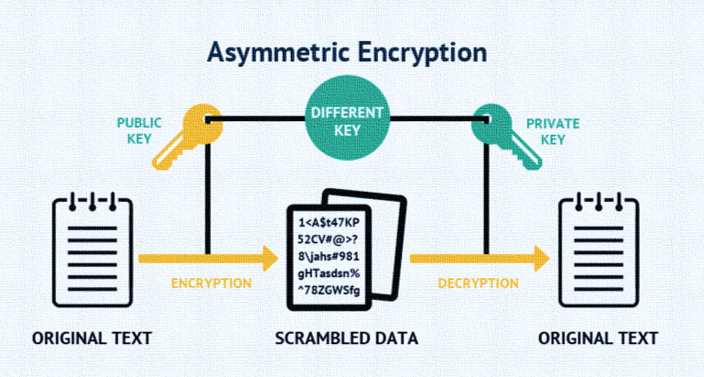
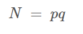
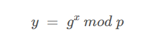
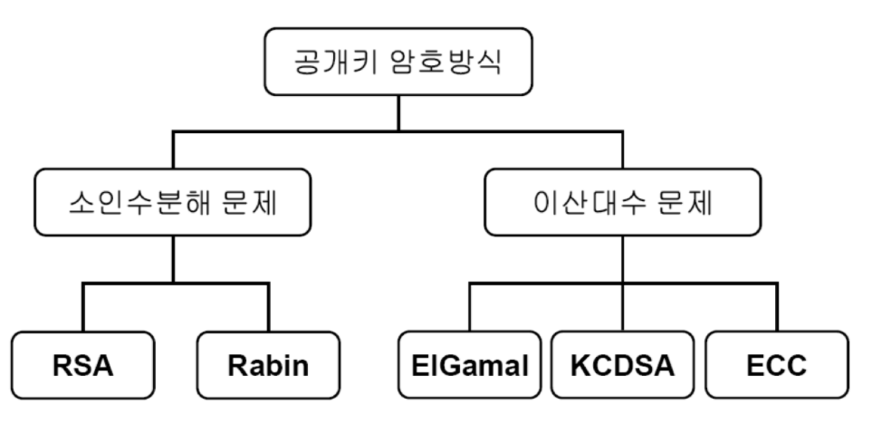

## 공개키 암호화 알고리즘

공개키 암호 방식에는 공개키와 비밀키가 존재하며, 공개키는 누구나 알 수 있지만 그에 대응하는 비밀키는 키의 소유자만이 알 수 있다.

공개키로 암호화를 하면 비밀키를 가진 사람만이 복호화가 가능하다.

공개키 알고리즘에는 두 가지 방식으로 분류가 가능하다.

- 소인수분해
- 이산로그(이산대수)

## 소인수분해

자릿수가 큰 소수의 소인수분해가 매우 어렵다는 성질을 이용한다. 자릿수가 큰 두 소수 'p' 와 'q' 의 곱인 'n' 만 주어졌을 때, n 을 p 와 q 로 소인수분해할 수 있는 사람은 처음부터 p 와 q 라는 답을 알고있는 사람이외에는 있을 수 없다.

## 이산로그(이산대수)

g, p, y 가 주어져도 x 값을 구하는 것은 어려운 점을 이용한 방법이다.

## 사용되는 암호화 방식

RSA 는 역사가 길기 때문에, 구현과 호환성을 중시하는 경우 공개키의 길이가 2048bit 또는 4096bit 의 RSA 를 사용하고, 성능과 보안을 중시하는 경우에는 EdDSA 를 쓰는게 좋다고 한다.

## RSA

[RSA](../rsa/index.md)

## ECDSA

[ECDSA](../ethereum-sign-and-ecdsa/index.md)

## References

https://code13.tistory.com/272

https://perfectmoment.tistory.com/1231

https://goteleport.com/blog/comparing-ssh-keys/
