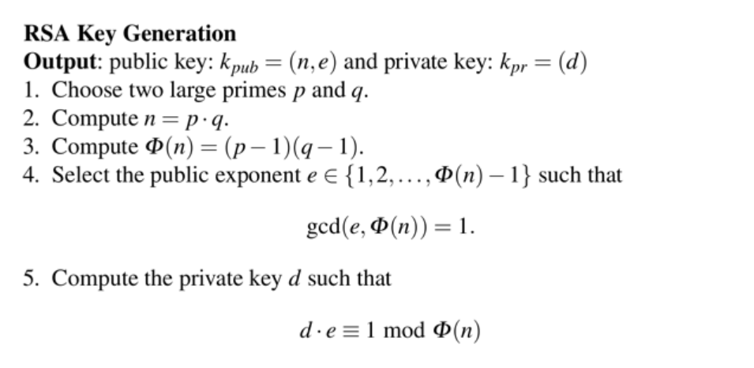

RSA 는 [공개키 암호](/crypto/공개키-암호화/)시스템의 하나로, 암호화 뿐만 아니라 전자서명이 가능한 최초의 알고리즘으로 알려져 있다. 전자 상거래에서 널리 이용되고 있다.

RSA 암호체계는 큰 숫자를 소인수 분해하는 것이 어렵다는 것에 기반을 두고 있다. 하지만 양자 컴퓨터가 실용화되면 임의의 정수를 다항 시간 안에 소인수 분해할 수 있어 RSA 의 보안에 큰 취약점이 생기지지만 양자 컴퓨터가 그정도로 실용화 되려면 여러 해가 필요하다고 한다. 그래서 블록체인에서는 [RSA 대신 ECDSA 를 사용해서 서명을 한다.](/blockchain/blockchain-에서-rsa-대신-ecdsa-를-사용하는-이유)

## RSA 키 생성

1. 서로 다른 소수 p, q 를 고른다.
2. p 와 q 를 곱해서 n 을 구한다.
3. 오일러 피 함수에 해당하는 φ(N) = (p-1)(q-1)을 구한다.
4. φ(N) 보다는 작으면서 φ(N)와 서로소인 정수 e를 찾는다. (1 < e < φ(N))
5. 확장된 유클리드 호제법을 이용해 e mod φ(n) = 1인 d를 구한다.

공개키: (n, e), 개인키: (n, d)

> RSA는 공개 키를 먼저 구한 다음에 개인 키를 구한다. ECC의 경우 RSA와 반대로 개인 키를 먼저 구한 후 공개 키를 구한다.

## References

https://ko.wikipedia.org/wiki/RSA_%EC%95%94%ED%98%B8

https://code13.tistory.com/272

https://m.blog.naver.com/PostView.naver?isHttpsRedirect=true&blogId=tkdgjs99&logNo=110032057061

https://rsec.kr/?p=426

https://security.stackexchange.com/questions/90169/rsa-public-key-and-private-key-lengths
