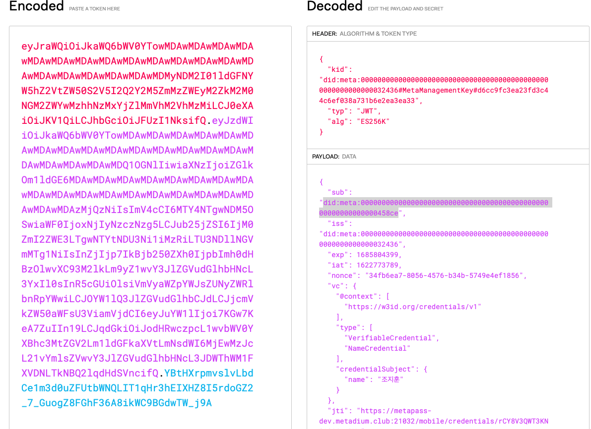

앱은 AA서버에 요청해서 VC 를 발급 받을 수 있습니다.

SP 서버에서 인증 요청이 오면

1. 앱은 저장된 VC 를 VP 로 만들어서, SP 서버에 보냅니다.
2. SP 서버는 VP 를 SDK 를 이용해 검증합니다.

아래에서 VP 를 어떻게 검증하는지 알아보겠습니다.

## VP 검증

아래 사진은 사용자가 보낸 VP 를 JWT Decoding 한 것입니다.



AA 서버는 Payload 의 iss 필드에 있는 DID 와 서명만을 이용해서 검증 할 수 있습니다.

즉, 아래 두 데이터를 이용합니다.

- did:meta:0000000000000000000000000000000000000000000000000000000000032436
- YBtHXrpmvslvLbdCe1m3d0uZFUtbWNQLIT1qHr3hEIXHZ8I5rdoGZ2_7_GuogZ8FGhF36A8ikWC9BGdwTW_j9A

위 두 데이터를 이용하면 Public key 를 얻을 수 있습니다. 그리고 그 두 개의 데이터로부터 얻은 Public key 를 비교해서 같다면 검증에 성공한 것입니다.

이것을 구체적으로 어떻게 하는지 알아보겠습니다.

### DID 를 통해 Public Key 구하기

DID 값을 DID Resolver 에 요청하면 DID Document 를 반환 받습니다. 아래 링크를 통해서 Resolver 에 요청할 수 있습니다.

[https://resolver.metadium.com/1.0/identifiers/did:meta:0000000000000000000000000000000000000000000000000000000000032436](https://resolver.metadium.com/1.0/identifiers/did:meta:0000000000000000000000000000000000000000000000000000000000032436)

```json
{
    "redirect": null,
    "didDocument": {
        "@context": "https://w3id.org/did/v0.11",
        "id": "did:meta:0000000000000000000000000000000000000000000000000000000000032436",
        "publicKey": [
            {
                "id": "did:meta:0000000000000000000000000000000000000000000000000000000000032436#MetaManagementKey#d6cc9fc3ea23fd3c44c6ef038a731b6e2ea3ea33",
                "type": "EcdsaSecp256k1VerificationKey2019",
                "controller": "did:meta:0000000000000000000000000000000000000000000000000000000000032436",
                "publicKeyHex": "04cb4323246dc93ba1a2c0319bff68dc9f60365dc4e1f0c302748250c064eee7ce6882ecd6d3b2c9b5afbc2682f9c500dadb7a825928a408068978ac91648d94e7"
            }
        ],
        ...
    },
		...
}
```

이제 우리는 DID 를 통해 Public Key 를 얻게 되었습니다.

### Signature 를 통해 Public Key 구하기

이제 서명값을 이용해보겠습니다. 아래는 JWT 서명값입니다.

`YBtHXrpmvslvLbdCe1m3d0uZFUtbWNQLIT1qHr3hEIXHZ8I5rdoGZ2_7_GuogZ8FGhF36A8ikWC9BGdwTW_j9A`

JWT Header 의 알고리즘을 보면 `ES256K` 가 서명 알고리즘으로 사용된 것을 확인할 수 있습니다.

`ES256K`는 JWT 에서 SECP256K1 의 알고리즘입니다. SECP256K1 의 알고리즘을 알고 있다는 가정하에 진행하겠습니다. SECP256K1 의 알고리즘이 사용됐기 때문에 Ecrecover 를 통해서 Signature로부터 Public key 를 구할 수 있습니다.

### 마무리 검증

이로써 우리는 DID Resovler 를 통해 요청한 Public key 와 Ecrecover 를 통해 얻은 Public key 와 비교해서 같다면 이것은 올바른 서명 및 사용자라는 것을 검증할 수 있게 됩니다.
