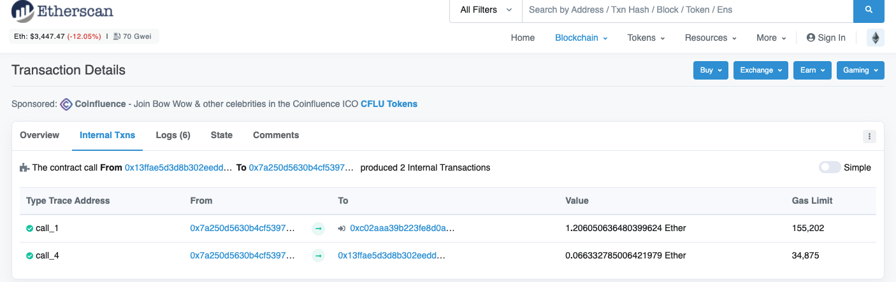

이더리움 기반 블록체인에서는 스마트 컨트랙트를 배포할 수 있다. 그 스마트 컨트랙트에서는 다른 스마트 컨트랙트를 호출하거나 이더를 보낼 수 있다. 그리고 트랜잭션의 해시를 안다면 그 이력들을 볼 수 있다.

아래 사진처럼 이더스캔에서 Internal Transaction 이라는 카테고리 하위에 컨트랙트의 통신에 대한 이력을 보여준다.



여기서 주의해야할 점은 이더스캔에서는 Internal Transaction 이라고 라벨링을 해두고 보여주고 있지만 이것은 실제로 블록체인에 해시를 갖고 기록되는 트랜잭션은 아니다. 이것은 그저 원래 Transaction 이 발생했을 때 함께 따라오는 데이터다.

지금부터 알아볼 것은 이 Internal Transaction 을 우리가 만들 소프트웨어에서 조회하는 것이다.
일반적으론 블록체인 데이터를 Web3 라이브러리의 구현체들로 가져올 수 있다. web3j, web3py, web3js 등의 라이브러리로 말이다. 그런데 이 데이터들은 현재 시점을 기준으로 Web3 에서 지원하는 함수는 없고 JSON RPC 를 호출하는 Web3 함수를 사용해서 Tracing 작업을 통해 가져와야 한다.

Transaction Hash 만 알고 있다면 Internal Transactions 을 조회할 수 있다.

Geth Client, JSON-RPC API, Web3js, Web3py 를 이용한 방법을 살펴보자.

## Geth Javascript API

이 방법은 Web3 라이브러리를 이용하는 것이 아니라 Geth 클라이언트를 이용하는 방법이다. 기본적인 원리를 접근하기 위해서 기술한다.

### Gath 클라이언트를 시작한다.

```bash
geth --cache=1024 --rpc --rpcapi "eth,net,web3,debug" console
```

### Javascript tracing code

```javascript
debug.traceTransaction(
  '0x3684f071b34da1116282ee88a106a8f2a266d273ef7d8964957f65128fb58d77'
)
```

### 결과 값

```json
{
  gas: 45480,
  returnValue: "0000000000000000000000000000000000000000000000000000000000000001",
  structLogs: [{
      depth: 1,
      error: "",
      gas: 76741,
      gasCost: 3,
      memory: null,
      op: "PUSH1",
      pc: 0,
      stack: [],
      storage: {},
      ...
  }]
}
```

structLogs 에 있는 데이터들 중 `op` 가 CALL 인 데이터들을 필터링해서 찾으면 된다.

## JSON-RPC API

JSON-RPC 를 이용한 방법이다. 여기도 결과값 조회 후 structLogs 에 있는 데이터들 중 `op` 가 CALL 인 데이터들을 필터링해서 찾으면 된다.

```bash
curl localhost:8545 -X POST --header 'Content-type: application/json' --data '{"jsonrpc":"2.0", "method":"debug_traceTransaction", "params":["0x3684f071b34da1116282ee88a106a8f2a266d273ef7d8964957f65128fb58d77", {}], "id":1}'
{"jsonrpc":"2.0","id":1,"result":{"gas":45480,"returnValue":"0000000000000000000000000000000000000000000000000000000000000001","structLogs":[{"pc":0,"op":"PUSH1","gas":76741,"gasCost":3,"depth":1,"error":"","stack":[],"memory":null,"storage":{}} ...
```

## Javscript Way: Web3js

Typescript 를 이용한 방법을 알아보자.

### Typescript code

```typescript
import { HttpProvider } from 'web3-core'
import { web3 } from '@/web3/provider'

const web3Provider = web3.currentProvider as HttpProvider
const txHash =
  '0x3cec64936e023a387fa77da729279714580fde5d6e0f14063b6505611261c81d'

web3Provider.send(
  {
    method: 'debug_traceTransaction',
    params: [txHash, {}],
    jsonrpc: '2.0',
    id: '2',
  },
  (err, result) => {
    console.log(result)
  }
)
```

### 결과값

```json
{
  jsonrpc: '2.0',
  id: '2',
  result: {
    gas: 69788,
    failed: false,
    returnValue: '',
    structLogs: [
      [Object], [Object], [Object], [Object], [Object], [Object],
      [Object], [Object], [Object], [Object], [Object], [Object],
      [Object], [Object], [Object], [Object], [Object], [Object],
      [Object], [Object], [Object], [Object], [Object], [Object],
      [Object], [Object], [Object], [Object], [Object], [Object],
      [Object], [Object], [Object], [Object], [Object], [Object],
      [Object], [Object], [Object], [Object], [Object], [Object],
      [Object], [Object], [Object], [Object], [Object], [Object],
      [Object], [Object], [Object], [Object], [Object], [Object],
      [Object], [Object], [Object], [Object], [Object], [Object],
      [Object], [Object], [Object], [Object], [Object], [Object],
      [Object], [Object], [Object], [Object], [Object], [Object],
      [Object], [Object], [Object], [Object], [Object], [Object],
      [Object], [Object], [Object], [Object], [Object], [Object],
      [Object], [Object], [Object], [Object], [Object], [Object],
      [Object], [Object], [Object], [Object], [Object], [Object],
      [Object], [Object], [Object], [Object],
      ... 1112 more items
    ]
  }
}
```

결과값의 structLogs 를 자세히 보면 다음과 같은 수많은 데이터들이 보인다.

```javascript
[
  {
    pc: 0,
    op: 'PUSH1',
    gas: 9978936,
    gasCost: 3,
    depth: 1,
    stack: [],
    memory: [],
    storage: {}
  },
  {
    pc: 2,
    op: 'PUSH1',
    gas: 9978933,
    gasCost: 3,
    depth: 1,
    stack: [
      '0000000000000000000000000000000000000000000000000000000000000080'
    ],
    memory: [],
    storage: {}
  },
  ...
]
```

이 데이터의 op 가 CALL, STATICCALL 인 것들을 필터를 걸면 Smart Contract 내에서 발생한 Internal Transaction 을 찾을 수 있다.

하지만 이렇게 찾으면 배열을 순회하는데도 많은 시간이 걸리고 데이터도 예쁘게 주지 않아서 직접 from address, to address, value, gas 같은 것을 파싱해서 사용해야 한다.

더 간편한 방법이 있는데 debug_traceTransaction 함수를 호출할 때 인자 하나를 넘기는 것이다. 코드로 살펴보자.

### Improved Typescript code

```typescript
import { HttpProvider } from 'web3-core'
import { web3 } from '@/web3/provider'

const web3Provider = web3.currentProvider as HttpProvider
const txHash =
  '0x3cec64936e023a387fa77da729279714580fde5d6e0f14063b6505611261c81d'

web3Provider.send(
  {
    method: 'debug_traceTransaction',
    params: [txHash, { tracer: 'callTracer' }], // 변경된 부분: { tracer: 'callTracer' } 코드 추가
    jsonrpc: '2.0',
    id: '2',
  },
  (err, result) => {
    console.log(result)
  }
)
```

### 결과값

```javascript
{
  jsonrpc: '2.0',
  id: '2',
  result: {
    type: 'CALL',
    from: '0x1903a239d2ffda3d0dfc733dd1d386bdc359bd23',
    to: '0x1e5be8e2b045890c6d642a1c7d773db10b7067db',
    value: '0x127c535d4df8340000',
    gas: '0x984438',
    gasUsed: '0xcebc',
    input: '0x1998aeef',
    output: '0x',
    time: '15.081899ms',
    calls: [{
      type: 'CALL',
      from: '0x1903a239d2ffda3d0dfc733dd1d386bdc359bd23',
      to: '0x1e5be8e2b045890c6d642a1c7d773db10b7067db',
      value: '0x127c535d4df8340000',
      gas: '0x984438',
      gasUsed: '0xcebc',
      input: '0x1998aeef',
      output: '0x',
      time: '14.983978ms',
      calls: [
        {
          type: 'STATICCALL',
          from: '0x1e5be8e2b045890c6d642a1c7d773db10b7067db',
          to: '0x6ef857e5d181f07d21e664cfcf0028478de1295e',
          gas: '0x95d8f0',
          gasUsed: '0x4ec',
          input: '0xd936547e0000000000000000000000001903a239d2ffda3d0dfc733dd1d386bdc359bd23',
          output: '0x0000000000000000000000000000000000000000000000000000000000000001'
        },
        {
          type: 'STATICCALL',
          from: '0x1e5be8e2b045890c6d642a1c7d773db10b7067db',
          to: '0x7d028795a625f4ec3e1d4f7534c3a63741039475',
          gas: '0x95a250',
          gasUsed: '0xc66',
          input: '0x6352211e0000000000000000000000000000000000000000000000000000000000000001',
          output: '0x0000000000000000000000001e5be8e2b045890c6d642a1c7d773db10b7067db'
        },
        {
          type: 'CALL',
          from: '0x1e5be8e2b045890c6d642a1c7d773db10b7067db',
          to: '0x1903a239d2ffda3d0dfc733dd1d386bdc359bd23',
          value: '0x126e72a69a50d00000',
          input: '0x'
        }
      ]
    }]
  }
}
```

결과값을 보면 최상단에 있는 CALL 타입의 데이터가 블록체인에 기록된 Transaction 의 데이터들이고, 그 밑에 calls 라는 필드명으로 배열에 있는 데이터들이 Internal Transaction 들이다. gas 와 address 같은 것이 잘 나오는 것을 볼 수 있다. 이 데이터들이 이더스캔의 internal transaction 탭에서 보이는 데이터와 순서까지 그대로 매핑되는 것을 볼 수 있다.

## Python Way: Web3py

### Python Code

```python
web3.manager.request_blocking('debug_traceTransaction', [tx_id, {'tracer': 'callTracer'}])
```

## debug_traceTransaction

그냥 조회하면 데이터들이 복잡하다. structLogs 배열 밑에 있는 데이터들을 필터링도 걸어야 되고 가공해서 우리가 사용할 수 있는 데이터로 만들어야 하는데 {'tracer': 'callTracer'} 옵션을 주면 CALL 에 관련한 데이터만 조회할 수 있고 데이터를 가공하지 않아도 되게 잘 데이터를 준다.

그런데 `{'tracer': 'callTracer'}`와 같은 옵션 파라미터들이 공식문서에 잘 나와있지 않다.

그나마 참고할만한 [링크1](https://geth.ethereum.org/docs/rpc/ns-debug#debug_tracetransaction)와 [링크2](https://ko.docs.klaytn.com/bapp/json-rpc/api-references/debug/tracing#tracing-options)를 참고하자

## References

https://ethereum.stackexchange.com/questions/9434/calling-debug-tracetransaction-from-web3-api
