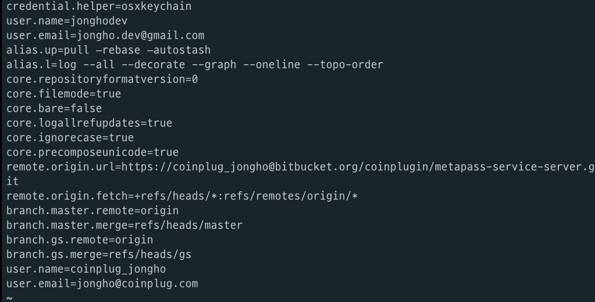
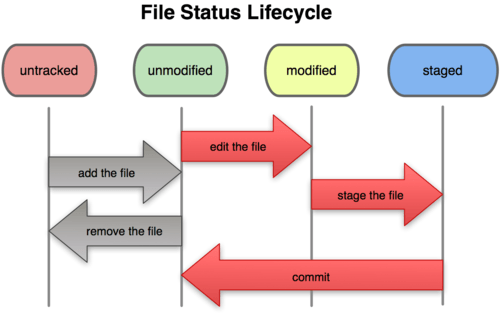
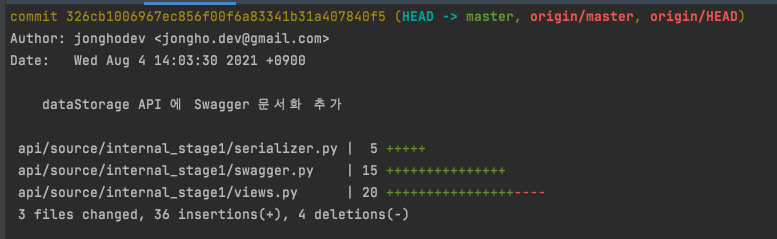

## Git config

### 설정 파일

- /etc/gitconfig: 시스템 설정
- ~/.gitconfig, ~/.config/git/config: 특정 사용자
- .git/config: 프로젝트 저장소

### 명령어

```bash
# Global 등록
git config --global user.name "jongho"
git config --global user.email "jongho.dev@gmail.com"

# Local 등록
git config --local user.name "coinplug_jongho"
git config --local user.email "jongho@coinplug.com"

# 조회
git config --list
```

`git config --list` 명령어로 조회할 때 여러 파일(/etc/gitconfig, ~/.gitconfig) 에서 읽기 때문에 값은 키가 여러 개 있을 수 있다. 그러면 Git 은 나중 값을 이용한다. 아래는 그 예제다.

이 프로젝트에서는 내가 직접 설정해줬기 때문에 [user.name](http://user.name) 키 값이 두 개다.



## Life Cycle



Git 에서 파일은 Tracked 와 Untracked 로 나뉜다. Untracked 는 체크아웃 후 방금 추가한 파일로 커밋이 한 번도 되지 않아 스냅샷에 포함된 적도 없고 Staging Area 에도 포함되지 않은 파일을 말한다. 그리고 Tracked 는 스냅샷에 포함된적이 있던 파일이다.

처음 저장소를 Clone 하면 모든 파일들은 Tracked 이면서 Unmodified 상태이다. 이 상태에서 파일을 수정하면 Modified 가 되고 Add 를 통해 커밋할 준비를 시키면 Staged 가 된다.

## Add

```bash
# 특정 파일 추가
git add <file>

# 모든 파일 추가
git add .

# 특정 파일 add 취소
git reset <file>

# 모든 파일 add 취소
git reset
```

## Commit

```bash
# Editor 를 연다.
git commit

# Editor 에 Diff 추가
git commit -v

# 미리 메시지 입력
git commit -m "add feacture"

# 커밋 수정하기
# case: 어떤 파일을 같이 커밋하고 싶을 때, 커밋 메세지를 잘못 적었을 때
# 아래 세 줄은 하나의 커밋으로 기록된다.
git commit -m 'initial commit'
git add forgotten_field
git commit --amend
```

## Remove

```bash
git rm
```

이 명령어는 실제 하드 디스크에서 파일을 삭제한다.

```bash
git rm --cached README.md
```

이 명령어는 실제 하드 디스크에서는 삭제하지 않고 Git 상에서만 제거한다.

그래서 .gitignore 에 추가하는 것을 잊었거나 대용량 로그 파일 같은 것을 실수로 추가했을 때 아주 유용하다.

## Log

```bash
git log
```

로그를 보여준다.

```bash
git log -p -3
```

-p: Diff 를 보여준다.

-3: 최근 3개의 커밋을 보여준다.

```bash
git log --stat
```

--stat: 어떤 파일이 수정됐는지, 얼마나 많은 파일이 변경됐는지, 얼마나 많은 라인을 추가하거나 삭제했는지 보여준다.



```bash
git log --pretty=oneline, short, full, fuller
```

pretty 옵션

```bash
git log --graph
```

Merge 결과의 히스토리를 더 입체적으로 볼 수 있다.

```bash
git log --since=2.weeks

git log --since=5.days

git log --since="2021-04-12"
```

시간을 기준으로 조회할 수 있다.

```bash
git log -S”원하는 Text”
```

특정 Text 가 포함되어 추가되거나 삭제된 로그를 보여줍니다.

## Remote

```bash
# 리모트 저장소 확인
git remote

# 결과
github
origin
```

어떤 remote 저장소가 있는지 간단하게 조회할 수 있다.

```bash
# 리모트 저장소 확인 url 포함
git remote -v

# 결과
github	https://github.com/jonghodev/seaman-api (fetch)
github	https://github.com/jonghodev/seaman-api (push)
origin	https://coinplug_jongho@bitbucket.org/coinplugin/seaman-dapp-api.git (fetch)
origin	https://coinplug_jongho@bitbucket.org/coinplugin/seaman-dapp-api.git (push)
```

리모트 저장소의 url 도 포함하여 조회할 수 있다.

```bash
git remote show origin
```

특정 리모트 저장소의 더 상세한 정보를 볼 수 있다.

## 태그

### 태그 조회

```bash
git tag
```

태그는 두 종류로 나뉜다. Lightweight 태그와 Annotated 태그다.

Lightweight 태그는 브랜치와 비슷한데 브랜치처럼 가리키는 지점을 최신 커밋으로 이동시키지 않는다. 단순히 특정 커밋에 대한 포인터일 뿐이다.

Annotated 태그는 Git 데이터베이스에 태그를 만든 사람의 이름, 이메일과 태그를 만든 날짜, 그리고 태그 메시지도 저장한다.

### Annotated 태그

```bash
git tag -a v1.4 -m 'my vesion 1.4'
```

## Git Password 입력 안 하게 하기

```bash
git config credential.helper store
```
