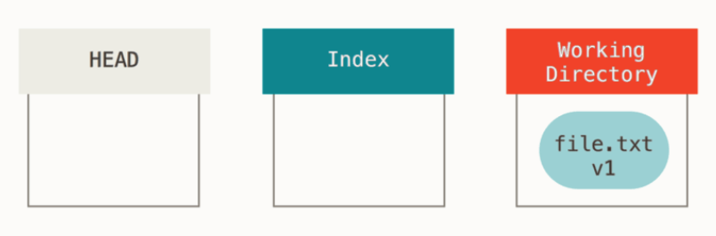
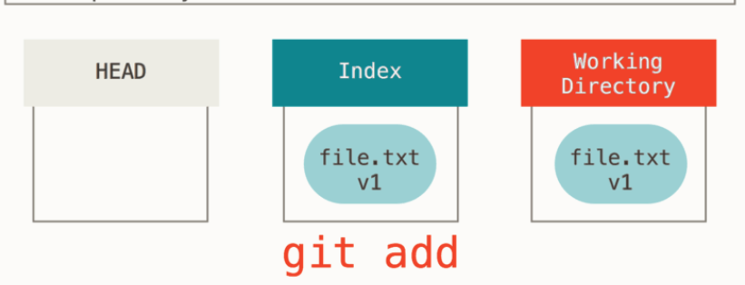
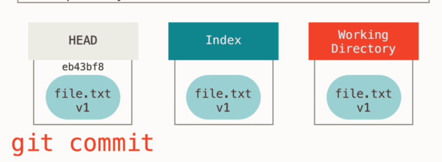
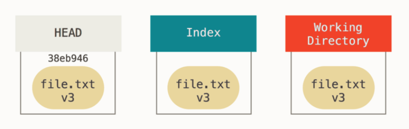
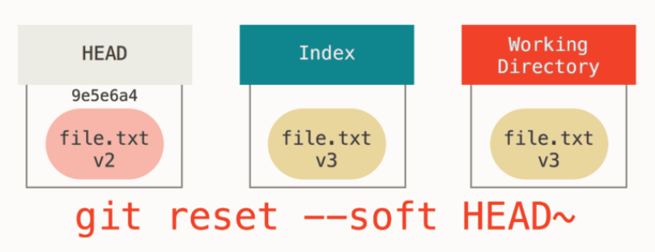
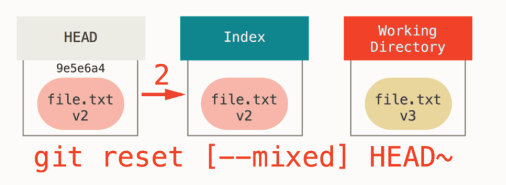
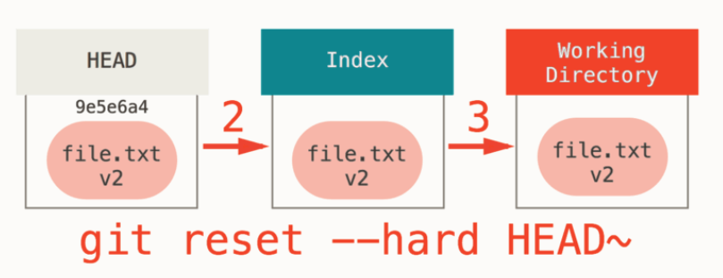
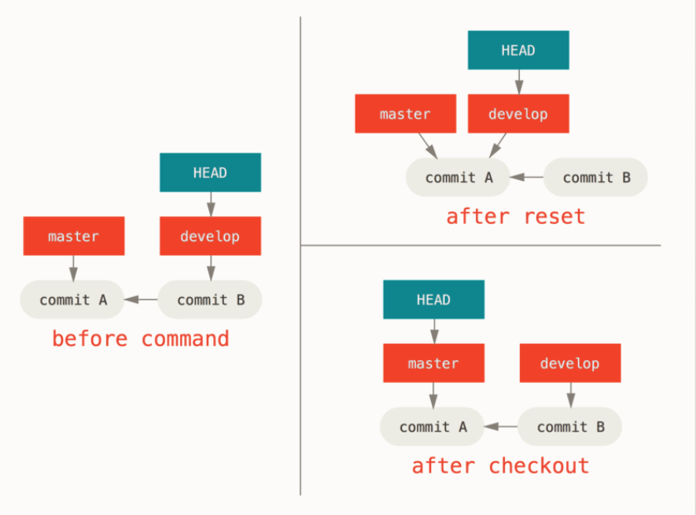

Git 은 HEAD, Index, Working Directory 이 3개를 관리하는 시스템이다. 즉 이 세가지가 키포인트라고 할 수 있다.

## 3개의 트리 이해하기

### Working Directory

로컬에 있는 파일을 수정함으로써 Working Directory 가 변경된다.

### Index

`git add` 명령어를 사용함으로써 Index 가 변경된다.

### Git commit

`git commit` 명령어를 사용해서 Index 의 내용을 스냅샷으로 만들고 그 스냅샷을 가리키는 커밋 객체를 만든다. 그리고 HEAD 가 가 그 커밋 객체를 가리키게 한다.

그리고 이때 `git status` 명령어를 실행하면 아무 변경사항이 없다고 나온다. 세 트리가 모두 같기 때문이다.

반대로 말하면 세 트리 중 하나라도 다른 것이 있다면 git status 에서는 변경사항이 있다고 나올 것이다.

Working Directory 에서는 수정을 했는데 Index 에 포함이 안 되어있다면 Untracked file, Index 에 포함시켰는데 Commit 이 되지 않았다면 Changes to be committed, 커밋을 한다면 nothing to commit.

## Reset

이제 위의 3개의 트리에서 벌어지는 일을 이해했다면 reset 은 쉽게 이해할 수 있다. reset 은 간단히 위 3개의 트리를 조작하는 방법이다.

Reset 에서는 다음의 기능을 한다. 아래로 내려갈 수록 더 많은 것을 업데이트 한다.

1. HEAD 이동 (soft reset)
2. Index 업데이트 (mixed reset)
3. Working Directory 업데이트 (hard reset)

현재 아래와 같은 Git 상태를 갖고있다고 해보자.

### HEAD 이동 (soft reset)

### Index 업데이트 (mixed reset)

default 가 mixed reset 이다.

### Working Directory 업데이트 (hard reset)

—hard 옵션은 매위 위험하다. Git 에서 데이터를 삭제할 수 있는 얼마 안 되는 방법 중 하나다.

## git reset vs git checkout

git reset 은 현재 브랜치가 가리키고 있는 HEAD 의 위치를 변경하고 git checkout 은 현재 HEAD 가 가리키고 있는 위치를 변경시킨다. 예제로 살펴보자.

왼쪽에서부터 보면 현재 HEAD 는 develop 이다.

여기서 `git reset master` 커맨드를 입력하면 develop 브랜치가 master 가 가리키고 있는 commit 을 가리키게 된다. 이때 기존에 commit B 에서 생긴 changeset 은 사라지게 되지만 git 이 이것을 보관하고 있으므로 `git restore` 명령으로 복구할 수 있다.

그리고 `git checkout master` 커맨드를 입력하면 develop 브랜치는 그대로 두고 HEAD 브랜치의 포인터만 master 브랜치로 옮긴다.

## References

https://git-scm.com/book/ko/v2/Git-%EB%8F%84%EA%B5%AC-Reset-%EB%AA%85%ED%99%95%ED%9E%88-%EC%95%8C%EA%B3%A0-%EA%B0%80%EA%B8%B0
