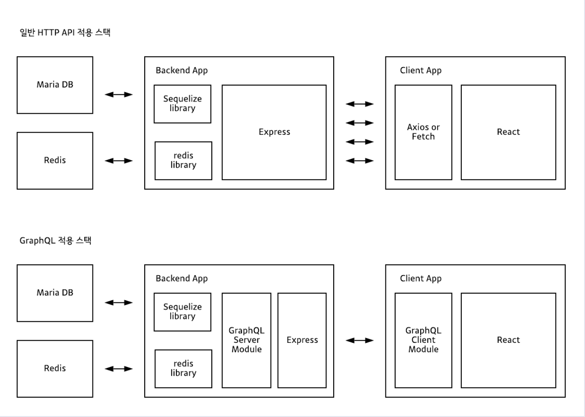
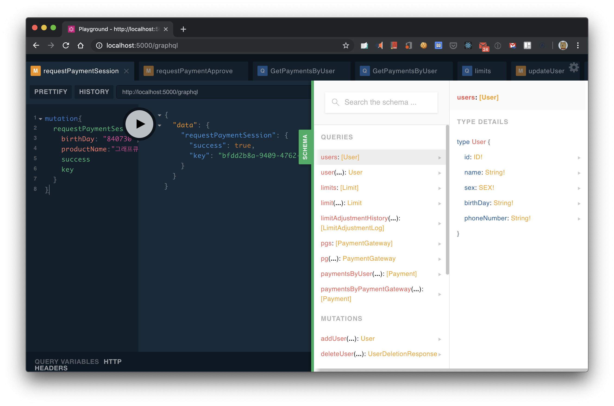

GraphQL 은 REST API 와 많이 비교 되곤한다. 그 이유는 둘 다 HTTP 를 활용하기 위한 여러가지 방법 중 하나이기 때문이고 (SoapAPI...)

REST API 가 최근 많이 사용되고, GraphQL 은 REST API 의 단점을 극복하기 위해 만들어 졌기 때문이다.

따라서 시작하기 앞서 REST API 에 대해서 간단히 알아본다.

## REST API

REST API 란 Representational State Transfer 의 약자이다.

자원을 이름으로 분류헤 자원의 상태를 주고 받는 모든 것을 의미한다.

하나의 자원은 하나의 Endpoint 에 연결이 된다.

그래서 Endpoint 마다 데이터베이스의 쿼리가 달라진다.

## GraphQL

GraphQL 은 Graph Query Language 의 약자이다.

Graphql 은 Server API 를 구성하기 위해 Facebook 에서 만든 Query Language 이다.

Grpahql 은 단일 Endpoint 를 사용한다.

요청시 Query 문에 따라 응답의 구조가 달라진다. 따라서 유연하다.

Facebook 에서 GraphQL 을 [만든 이유](https://graphql.org/blog/graphql-a-query-language/)는 다음과 같다.

> RESTful API 로는 다양한 기종에서 필요한 정보들을 일일히 구현하는 것이 힘들었다.
> 예로, iOS 와 Android 에서 필요한 정보들이 조금씩 달랐고, 그 다른 부분마다 API 를 구현하는 것이 힘들었다.

이 때문에 클라이언트에서 원하는 정보만 가지고 올 수 있게 표준화된 Query Language 를 만들게 된 것이다.

GraphQL 을 사용하게 되면 상대적으로 Backend 의 부담이 줄고 Front 에 부담이 증가하게 된다.

GraphQL 의 장점 중 하나는 Over Fetch 를 줄일 수 있다는 것이다. 자신이 필요한 데이터는 1갠데

REST API 를 사용할 경우 모든 Data 를 Fetch 해야하는 부담이 있을 수 있다.

## GraphQL 구조

잘 표현이 된 사진이 있어 [출처](https://tech.kakao.com/2019/08/01/graphql-basic/)에서 가져왔다.

RestAPI 의 경우 Client 단에서 Axios 같은 것으로 HTTP Method 로 Backend 에서 데이터를 가져올 수 있지만

GrpahQL 의 경우, Graphql Client Module 을 설치하고, 서버에 질의 할 스키마를 정의 한다.

그리고 그 스키마를 바탕으로 Gql Client Module 이 Server 에 요청을 하고, 서버에서는 Graphql Server Module 이 스키마를 받아서

데이터베이스에 질의하는 방식이다. 즉, 어떤 Graphql Module 에 대한 학습이 필요하다.

그 라이브러리로 [Apollo](https://www.apollographql.com/) 와 [Relay](https://relay.dev/) 가 있다.

Relay 는 Facebook 이 만들었다. 내 주위를 보면 **Apollo** 를 많이 사용하는 것 같다.

Apollo Client 를 사용하고 local state state management 를 이용하면 Redux 를 대체하여 사용이 가능해진다.

## Introspection

기존에는 클라이언트와 서버 간의 연동구격서라는 API 명세서를 주고 받는 절차가 있었다. 프로젝트에서 그것을 관리하는 것도 또한 비용인데.

GraphQL 의 Apollo Server 라는 라이브러리는 그 규격을 정의할 필요 없이, 현재 서버에 정의된 스키마 정보를 실시간으로 공유해준다.

## GrpahQL 장점

- HTTP 요청 수를 줄일 수 있다.
- RESTFul 은 Resource 종류에 따라 요청 횟수가 비례한다. 반면 GraphQL 은 원하는 정보를 하나의 Query 에 담아 요청하는 것이 가능하다.
- HTTP 응답의 사이즈도 줄일 수 있다.
- Gql 라이브러리의 Introspection 제공으로 인해, API 명세서 제작 및 교환에 대한 부담을 줄인다.

## GrpahQL 단점

- File 전송 등 Text 만으로 하기 힘든 내용을 처리하기 복잡하다.
- 고정된 요청과 응답만 필요할 경우에는 Query 로 인해 요청의 크기가 Restful API 의 경우보다 더 커진다.
- 재귀적인 Query 가 불가능하다.
- Gql 라이브러리에 대한 추가 학습이 필요하다.

## GraphQL vs REST API

둘 중 무엇을 선택할지에 대한 기준은 다음과 같다.

### GrpahQL

- 다양한 요청에 응답할 수 있어야 할 때
- 대부분의 요청이 CRUD 에 해당할 때

### REST API

- HTTP 와 HTTPS 의 Cashing 을 잘 사용하고 싶을 때
- File 전송 등 단순한 Text 로 처리되지 않는 요청이 있을 때
- 요청의 구조가 정해져 있을 때

## 결론

요즘의 OpenAPI 는 모두 REST API 로 작성이 된다. 아직은 GraphQL 이 모든 에코 시스템을 장악하리라곤 생각이 들지 않는다.

그렇지만 페이스북과 같은 유즈케이스를 갖는 곳에서는 GraphQL 을 많이 사용하려 할 것 같다.

그리고 하이브리드 형태로 REST 와 GraphQL 을 함께 사용할 수도 있겠지만 프로젝트의 복잡성이 증가하고 API 의 품질이 낮아지니 잘 고려해보고 사용해야겠다.

## 참고

[GraphQL Spec](https://github.com/graphql/graphql-spec)

## References

https://tech.kakao.com/2019/08/01/graphql-basic/

https://velog.io/@bclef25/REST-API-%EC%99%80-graphQL#:~:text=RESTful%20%EC%9D%80%20%EA%B0%81%20Resource%20%EC%A2%85%EB%A5%98,Size%20%EB%A5%BC%20%EC%A4%84%EC%9D%BC%20%EC%88%98%20%EC%9E%88%EB%8B%A4.
