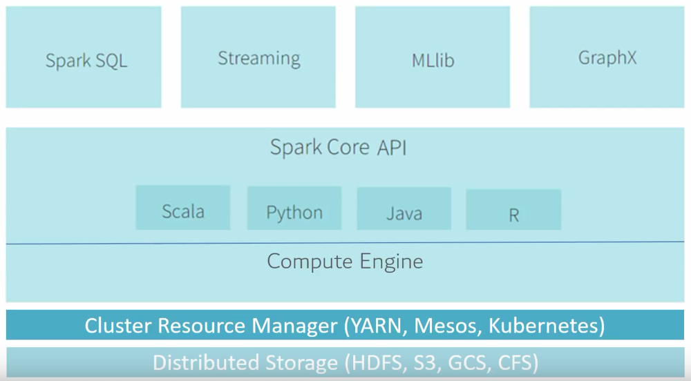

## MapReduce

입력 데이터를 스토리지에 읽고 다수의 머신에서 분산처리를 수행한 결과를 스토리지에 저장한다.

### 장점

맵리듀스 처리하면 정간결과가 항상 스토리지에 저장되어서 데이터 크키가 커도 문제 없이 동작하며, 장애 발생 시에도 쉽게 복구된다.

### 단점

하지만 특정 데이터의 부분집합에 대해 여러 번 처리하는 애플리케이션일 경우에는 맵리듀스로 효율적인 처리가 어렵다.

이럴경우 매번 중간 데이터를 다시 읽어야 하기 DISK I/O 로 인한 시간 지연이 생긴다.

> 반면 Spark 는 연속적인 처리에서 불필요한 디스크와 네트워크 I/O 가 발생하지 않도록 처리한다.

## Hadoop

빅데이터의 개념이 등장했을 때, Hadoop 의 에코시스템이 시장을 지배했다.

하둡은 HDFS(Haddop Distributed File System)라고 불리는, 분산형 파일 시스템을 기반으로 만들어졌다.

데이터 처리 시, HDFS 와 MapReduce를 사용해 대형 데이터셋을 병렬 처리한다.

하둡은 MapReduce 를 기반으로 하다보니 DISK I/O 를 기반으로 동작하는데, 점점 실시간성 데이터에 대한 니즈가 급격하게 증가하면서 하둡으로 처리하기에는 속도 측면에서 부적합한 워크로드(Workloads)가 생기게 된다.

더 나아가, 컴퓨터 H/W 들의 가격이 빠른 속도로 하락하면서

기존에 고가로 취급되던 메모리를 고용량으로 사용할 수 있게 되었다.

이때 등장한 것이 Apache Spark이다.

## Apache Spark

**Apache Spark** 는 In-Memory 상에서 동작하기 때문에,

반복처리가 필요한 작업에서, 속도가 하둡보다 최소 1000배 이상 빠르다.

이를 통해 **데이터 실시간 스트리밍 처리**라는 니즈를 충족함으로써, 빅데이터 프레임워크 시장을 빠르게 잠식해가고 있다.

### 하둡과 스파크의 관계

최근에 드러서는 경쟁 관계를 넘어서,

**하둡 + 스파크**라는 둘의 연계가 하나의 큰 흐름으로 자리 잡았다.

하둡의 YARN 위에 스파크를 얹고, 실시간성이 필요한 데이터를 스파크로 처리하는 방식으로,

대부분의 기업들과 연구단체에서 이와 같은 아키텍처를 구성하여 동작 중에 있다.

### Spark의 구조

스파크는 다양한 컴포넌트와 라이브러리를 지원한다.

기본적으로 Scala, JAVA, Python 등의 다양한 언어 기반의 고수준 API 사용이 가능하다.

더 나아가 SQL 기능을 담당하는 Spark SQL, 실시간 데이터 처리를 지원하는 Spark Streaming, 여러 머신러닝 기법을 지원하는 MLlib 등 다양하고 넓은 범위의 라이브러리가 있으며, 지속적으로 확장되어가고 있다.

특히 MLlib는 최근 크게 곽광받고 있어, 금융권 등 국내의 실시간 분석에서 스파크의 비율이 압도적으로 높은 추세다. 물론, Tensorflow/Pytorch 등을 활용한 딥러닝 정도의 퍼포먼스는 현재 발휘하지 못 하지만, 기계학습 분야에서는 충분한 퍼포먼스를 발휘하고 있다.

또한 Spark Streaming은 Kafka, Hadoop과 연게 가능한 스파크의 확장성 덕분에, 위와 같은 구조로 대부분의 기업에서 활용되고 있다.

카프카, 플럼, 키네시스, TCP 소켓 등 다양한 경로를 통해서 데이터를 입력받고, map, reduce, window 등의 연산을 통해 데이터를 분석하여 최종적으로 파일시스템, 데이베이스 등에 적재된다.

## References

https://artist-developer.tistory.com/7

https://deviscreen.tistory.com/109

https://towardsdatascience.com/getting-started-with-apache-spark-ad9d59e71f6f
