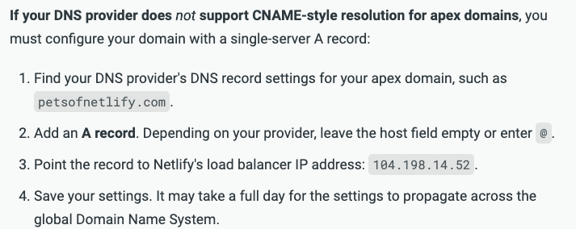

[Apex Domain](https://www.quora.com/What-is-an-apex-domain) 이란 Sub domain 을 포함하지 않은 Root Domain 을 말한다.

DNS 설정에서 Apex Domain 을 설정해주자.

Apex Domain 은 Cname 으로 설정할 수 없어 자신이 Deploy 하고 있는 곳의 A record 를 사용해야 한다.

Wix 라면 Wix 측에서 제공하는 A record 를 사용하면 된다.

필자같은 경우 Netlify 를 사용하고 있다.

그래서 [이곳](https://docs.netlify.com/domains-https/custom-domains/configure-external-dns/#configure-an-apex-domain)에서 참조를 해서
A record 받아 사용했다.

위 사진을 보면 Netlify Load balancer 로 `104.198.14.52` 을 제공하는 것을 알 수 있다.

따라서 위와 같이 설정을 했다.
