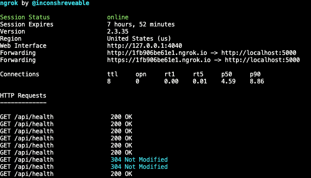

우리는 Local 에서 서버를 띄우고 외부 테스트를 위해서 배포를 한다.

그런데 Local 에서 띄운 것을 바로 외부로 연결하는 방법이 있다.

ngrok 을 이용하면 ngrok 에서 public 하게 접속하게 만들어 준다.

https://ngrok.com/

## 설치

```bash
yarn add ngrok
```

## 실행

```bash
ngrok http 3000
```

## 실행 화면



## Use case

결제사 같은 곳에서 Webhook 테스트를 할 때 무조건 배포를 해야 테스트를 했어야 했는데

이 방법을 사용하면 배포하지 않고도 로컬에서 간단하게 테스트할 수 있을 것 같다.

Https 도 지원하니 참 좋은 것 같다.
