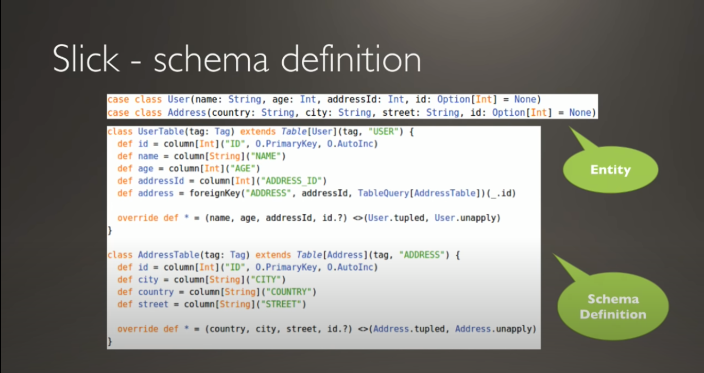
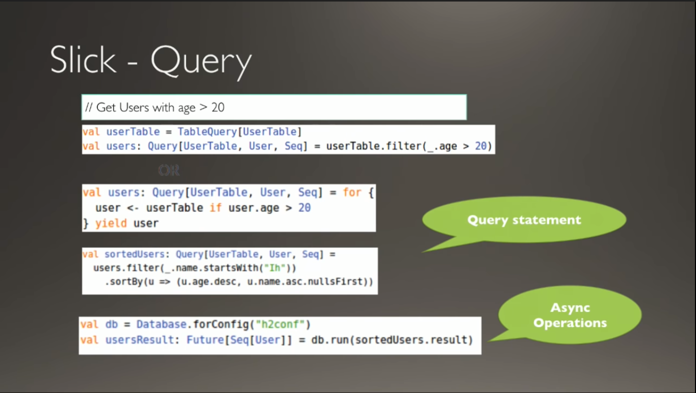
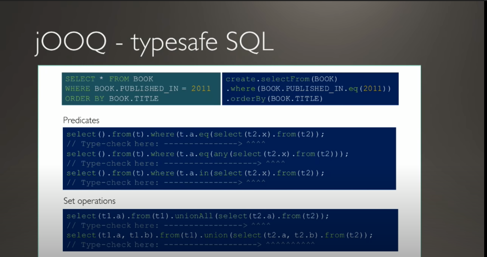

## 참고한 영상

[https://www.youtube.com/watch?v=2zQdmC0vnFU](https://www.youtube.com/watch?v=2zQdmC0vnFU) 위 영상을 보고 정리한다.

## Pros of JPA

ORM 특징이기도 하지만 DB Vendor 를 변경할 수 있어서 솔루션 납품할 때 좋다.

-> 하지만 DB Vendor 를 변경할 일이 많이 없는 서비스 회사에서는 의미 없을 수 있다.

API 를 사용함으로써 Typed Sql 사용이 가능하다.

## Cons of JPA

Hibernate 의 경우 Learning Curve 가 매우 높다.

Bulk or Set Operator 에 적합하지 않는다.

High throughput Service 에 적합하지 않는다.

Thread Context 의 제한을 받는다.

퍼포먼스 개선을 위해 JPA Vendor 고유의 어노테이션을 알아야 한다.

## Alternative: Slick

- Scala DB Access Mature library
- Stateless
- 구현 난이도는 높지만 성능이 좋다.

### DB Schema

## Alternative: JOOQ

- Typesafe SQL

- Stateless

DB Schema 를 먼저 생성한 후 자바 클래스를 생성해야해서 Class 를 먼저 만들고 DB Schema 가 만들어지는 OOP 적인 발상과 어울리지 않는다.

DBMS Owner Authrity 가 필요하다.

### Qurey

- SQL 문을 짜는 것과 비슷한 느낌이어서 Mybatis 상위 호환 같은 느낌이다.

## Alternative: Requrey

Proxy 가 없다.

QueryDSL 같은 Typed Query language 가 있다.

Upsert 가 있어서 getById 없이 업데이트가 가능하다.

Entity **Stateless** 하다. -> Thread 의 제한을 받지 않는다.

Blocking / Non-blocking API 를 지원한다.

Column 별 select lazy loading 이 가능하다.

Bulk Job 의 경우 JPA 100배 이상 빠르다.

REST API 의 경우 최대 10배 이상의 Throughput 을 보여준다.

## Alternative: Exposed

- Kotlin Lightweight SQL Library

현재 내가 회사 프로젝트에 적용해보고 있다.

Kotlin 을 사용할 때만 해당되는 선택지다.

QueryDSL 처럼 SQL DSL 개발을 할 수 있다.

jdbc 기반의 blocking connection 을 하는 것으로 보아 spring webflux 와의 조합을 기대하긴 힘들 것 같다.

JPA Hibernate 를 사용할 때보다 가벼운 느낌이 들고 Annotation 이 그렇게 많이 보이지 않는다. 따라서 Vendor Sepcific Annotaiton 에 대한 Learning 이 필요하다곤 생각이 들지 않는다.

Documentation 은 [Github Wiki](https://github.com/JetBrains/Exposed/wiki)을 참고하면 되고 관련 자료가 많지는 않다.

현재 0.28.1 Version 까지 Release 되었고 버전 1점대가 넘지 않는 것으로 아직 개발할 사항이 많은 것 같다.

현재 버전 기준으로 auto createdAt, modifiedAt 같은 컬럼을 생성해주는 기능이 없어 아쉽고 base table 을 만들어 중복을 줄이는 방법이 아직 해결책이 따로 없는 것 같다.

## References

[https://github.com/requery/requery](https://github.com/requery/requery)

[https://github.com/JetBrains/Exposed](https://github.com/JetBrains/Exposed)
