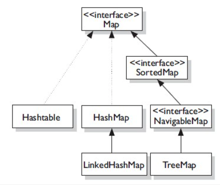

Map 은 인터페이스다. 그 인터페이스를 구현하고 있는 추상 클래스인 `AbstractMap` 이 있고

HashMap 과 TreeMap 은 `AbstractMap` 을 상속받고 있다.

```java
public interface Map<K, V> { ... }

public abstract class AbstractMap<K,V> implements Map<K,V> { ... }

public class HashMap<K,V> extends AbstractMap<K,V>
    implements Map<K,V>, Cloneable, Serializable { ... }

public class TreeMap<K,V>
    extends AbstractMap<K,V>
    implements NavigableMap<K,V>, Cloneable, java.io.Serializable { ... }
```

## LinkedHashMap

LinkedHashMap 은 HashMap 을 상속을 받고 있다.

그래서 HashMap 의 모든 기능을 갖고 있는 동시에 순서를 유지해주는 기능을 갖고 있다.

```java
public class LinkedHashMap<K,V>
    extends HashMap<K,V>
    implements Map<K,V> { ... }
```

해시맵은 데이터를 넣은 순서를 기억하지 않는다. `put()` 함수를 통해서 데이터를 넣은 순서가 저장되지 않는 다는 것이다. 반면 LinkedHashMap 은 그 순서를 기억하고 있다.

특징을 알아보자.

- HashMap 을 상속하기 때문에, get, put, remove, containsKey 함수는 O(1) 의 시간 복잡도를 갖는다.
- Double-Linked List 로 모든 Entry 를 유지한다.
- HashMap 과 마찬가지로 Thread-Safe 하지 않다. 동기화에 주의해 사용해야 한다.
- Value 에 Null 허용한다.

## EntryMap

Map 인터페이스에는 Entry 라는 Nested 인터페이스가 있다. 파이썬의 튜플과 비슷하다. Entry 객체에서는 `getKey(), getValue()` 함수를 이용해서 key, value 를 조회할 수 있다.

Map 인터페이스의 `entrySet()` 함수를 통해서 Entry 객체를 Set 으로 Wrapping 해서 받을 수 있다. 해시맵에 있는 데이터들은 순서가 없으므로 Set 컬렉션에 그 데이터들을 넣는 것이다.

`entrySet()` 함수를 통해서 반환되는 값은 다음과 같은 구조다. { ("test1", 1), ("test2", 2), ("test3", 3) }

```java
package com.test.jongho;

import java.util.HashMap;
import java.util.Map;
import java.util.Set;

public class Main {
    public static void main(String[] args) {
        HashMap<String, Object> map = new HashMap<>();
        map.put("test1", 1);
        map.put("test2", 2);
        map.put("test3", 3);
        Set<Map.Entry<String, Object>> setEntry = map.entrySet();

        for (Map.Entry<String, Object> entry : setEntry) {
            System.out.println(entry.getKey());
            System.out.println(entry.getValue());
        }
    }
}
```

## 해시 테이블 vs 해시 맵

해시 테이블

- 멀티 스레딩, 병렬 처리를 할 때 (동기화 고려)
- Null 값 허용하지 않는다.

해시 맵

- 병렬 처리를 안 할 때 (동기화 고려 X)
- Null 값 허용

## Reference

[https://www.codebyamir.com/blog/how-to-use-a-map-in-java](https://www.codebyamir.com/blog/how-to-use-a-map-in-java)
