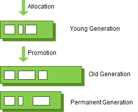
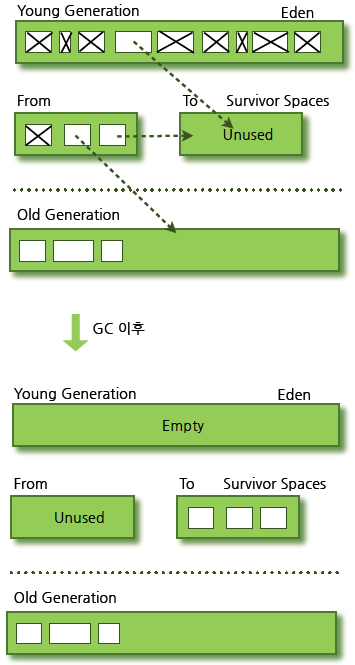

## GC 과정

### weak generational hypothesis

- 대부분의 객체는 금방 접근 불가능 상태(unreachable)가 된다.
- 오래된 객체에서 젊은 객체로의 참조는 아주 적게 존재한다.

위 가설의 장점을 최대한 살리기 위해서 HotSpot VM 에서는 크게 2개로 물리적 공간을 나누었다.

Young 영역과 Old 영역이다.

### Young 영역과 Old 영역

- Young 영역: 새롭게 생성한 객체의 대부분이 여기에 위치한다. 대부분의 객체가 금방 접근 불가능한 상태가 되기 때문에 매우 많은 객체가 Young 영역에 생성되었다가 사라진다. 이 영역에서 객체가 사라질 때 Minor GC 가 발생했다고 말한다.
- Old 영역: 접근 불가능 상태로 되지 않아 Young 영역에서 살아남은 객체가 여기로 복사된다. 대부분 Young 영역보다 크게 할당하며, 크기가 큰 만큼 Young 영역보다 GC 는 적게 발생한다. 이 영역에서 객체가 사라질 때 Major GC(혹은 Full GC) 가 발생한다고 말한다.

Permanent Generation 영역은 Method Area 라고도 한다. 객체나 억류된 문자열 정보를 저장하는 곳이며 이곳에서 발생한 GC 는 Major GC의 횟수에 포함된다.

### Card Table

Old 영역에 있는 객체는 Young 영역의 객체를 참조하기 위해 512바이트의 덩어이(chunk)로 되어 있는 Card Table 을 둔다.

그래서 Young 영역의 GC 를 실행할 때 이 Card Table 만 뒤져서 GC 대상인지 확인한다.

## Young 영역의 구성

객체가 제일 먼저 생성되며 Minor GC 가 일어나는 Young 영역은 3개의 영역으로 나뉜다.

- Eden 영역
- Survivor 영역(2개)

### Young 영역의 처리 절차

- 새로 생성한 대부분의 객체는 Eden 에 위치한다.
- Eden 영역에서 GC 가 한 번 발생한 후 살아남은 객체는 Survivor 영역 중 하나로 이동한다.
- Eden 영역에서 GC 가 발생하면 이미 살아남은 객체가 존재하는 Survivor 영역으로 객체가 계속 쌓인다.
- 하나의 Survivor 영역이 가득 차게 되면 그 중에서 살아남은 객체를 다른 Survivor 영역으로 이동한다. 그리고 가득 찬 Survivor 영역은 아무 데이터도 없는 상태가 된다.
- 이 과정을 반복하다보면 살아남은 객체는 Old 영역으로 이동하게 된다.

이 절차에 따르면, Survivor 영역 중 하나는 반드시 비어있는 상태로 남아있어야 한다. 만약 두 Survivor 영역에 모두 데이터가 존재하거나, 두 영역 모두 사용량이 0이라면 시스템이 정상적인 상황이 아닌 것이다.

### References

https://d2.naver.com/helloworld/1329

https://12bme.tistory.com/57

https://hoonmaro.tistory.com/19

https://medium.com/platform-engineer/understanding-jvm-architecture-22c0ddf09722

https://yaboong.github.io/java/2018/06/09/java-garbage-collection/
