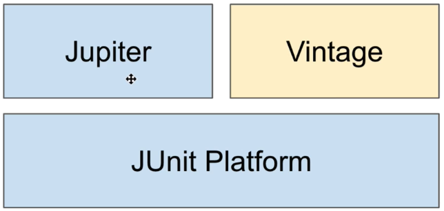
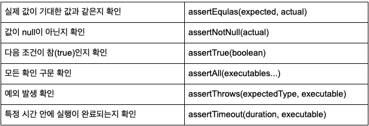

## 1. 소개

자바 개발자가 가장 많이 사용하는 테스트 프레임워크입니다.

[Jetbrain](https://www.jetbrains.com/lp/devecosystem-2020/java/)에 소개된 설문에 따르면, JAVA개발자의 83%가 JUnit, 43%가 Mockito를 사용하고 있습니다.

## 2. JUnit 4 와 비교



JUnit 4는 하나의 Jar로 구성된 반면, JUnit 5는 3가지 모듈로 분리되었습니다.

JUnit5 = JUnit Platform + JUnit Jupiter + JUnit Vintage

- JUnit Platform: 테스트를 실행해주는 런처를 제공합니다. TestEngine API를 정의합니다.
- Jupiter: JUnit 5를 위한 TestEngine API 의 구현체입니다.
- Vintage: JUnit 3와 JUnit 4를 위한 TestEngine API 의 구현체입니다.

```java
// @Test Annotation을 junit jupiter에서 가져오는 것을 확인할 수 있습니다.
import org.junit.jupiter.api.Test;

/**
 * 원래 자바는 main 메소드가 아니면 실행이 안 되지만
 * @Test 어노테이션이 붙어 있는 함수를 Intellij에서 실행해 줍니다.
*/
@Test
void test() {

}
```

## 3. 시작

- Spring Boot 2.2 버전으로 올라가면서 JUnit4에서 JUnit5가 기본 도구가 되었습니다.
- Java 8 Runtime 이상을 요구합니다.

### 스프링 부트 프로젝트를 사용하지 않는다면?

<dependency>
    <groupId>org.junit.jupiter</groupId>
    <artifactId>junit-jupiter-engine</artifactId>
    <version>5.5.2</version>
    <scope>test</scope>
</dependency>
```

### 기본 애노테이션

- @BeforeAll / @AfterAll
- @BeforeEach / @AfterEach
- @Disabled

## 4. 테스트 이름 표시하기

@DisplayNameGeneration

- Method와 Class 레퍼런스를 사용해서 테스트 이름을 표기하는 방법 설정.
- 기본 구현체로 ReplaceUnderscores 제공

@DisplayName

- 어떤 테스트인지 테스트 이름을 보다 쉽게 표현할 수 있는 방법을 제공하는 애노테이션.
- @DisplayNameGeneration 보다 우선 순위가 높다.

참고: [https://junit.org/junit5/docs/current/user-guide/#writing-tests-display-names](https://junit.org/junit5/docs/current/user-guide/#writing-tests-display-names)

```java
package dev.jongho.membertest.junit5;

import org.junit.jupiter.api.*;

import static org.junit.jupiter.api.Assertions.assertEquals;

@DisplayNameGeneration(DisplayNameGenerator.ReplaceUnderscores.class)
class DisplayNameTest {

    @Test
    void display_name_not_exists() {
        assertEquals(1, 1);
    }

    @Test
    @DisplayName("테스트 제목")
    void display_name_exists() {
        assertEquals(1, 1);
    }
}
```

## 5. Assertion



위와 같은 Assertion API 를 제공하지만 AssertJ 나 Hemcrest 등의 라이브러리를 사용할 수 있습니다.

## 6. 조건에 따라 테스트 실행하기

org.junit.jupiter.api.Assumptions.\*

- assumeTrue(조건)
- assumingThat(조건, 테스트)

@Enabled**_ 와 @Disabled_**

- OnOS
- OnJre
- IfSystemProperty
- IfEnvironmentVariable

```java
package dev.jongho.membertest.junit5;

import org.junit.jupiter.api.Test;
import org.junit.jupiter.api.condition.EnabledOnJre;
import org.junit.jupiter.api.condition.EnabledOnOs;
import org.junit.jupiter.api.condition.JRE;
import org.junit.jupiter.api.condition.OS;

import static org.junit.jupiter.api.Assertions.assertEquals;
import static org.junit.jupiter.api.Assumptions.assumingThat;

class ConditionalTest {

    @Test
    void assuming_that_1() {
        assumingThat(1 + 1 == 2, () ->
            assertEquals(1, 1)
        );
    }

    @Test
    void assuming_that_2() {
        assumingThat(1 + 1 == 3, () ->
                assertEquals(1, 2)
        );
    }

    @Test
    @EnabledOnOs(OS.MAC)
    void enabled_on_os() {
    }

    @Test
    @EnabledOnJre(JRE.JAVA_8)
    void enabled_on_jre() {
    }
}
```

## 7. 태그

- 태그를 붙여서 필터링을 할 수 있습니다.
- JUnit 5 애노테이션을 조합하여 커스텀 태그를 만들 수 있습니다.

```java
package dev.jongho.membertest.junit5;

import org.junit.jupiter.api.Tag;
import org.junit.jupiter.api.Test;

class TagTest {

    @Test
    @Tag("slow")
    void test_slow1() {

    }

    @Test
    @Tag("slow")
    void test_slow2() {

    }

    @Test
    @FastTest
    void test_fast1() {

    }

    @Test
    @FastTest
    void test_fast2() {

    }
}
```

```java
package dev.jongho.membertest.junit5;

import org.junit.jupiter.api.Tag;
import org.junit.jupiter.api.Test;

import java.lang.annotation.ElementType;
import java.lang.annotation.Retention;
import java.lang.annotation.RetentionPolicy;
import java.lang.annotation.Target;

@Target(ElementType.METHOD)
@Retention(RetentionPolicy.RUNTIME)
@Tag("fast")
@Test
public @interface FastTest {
}
```

## 8. 테스트 반복하기

@RepeatedTest

- 반복 횟수와 반복 테스트 이름을 설정할 수 있다.
  - {currentRepetition}
  - {totalRepetitions}
- RepetitionInfo 타입의 인자를 받을 수 있다.

```java
package dev.jongho.membertest.junit5;

import org.junit.jupiter.api.RepeatedTest;
import org.junit.jupiter.api.Test;

class RepeatTest {

    @Test
    @RepeatedTest(value = 10, name = "{currentRepetition}/{totalRepetitions}")
    void repeat_test() {
    }
}
```

@ParameterizedTest

- 테스트에 여러 다른 매개변수를 대입해가며 반복 실행한다.
  - {displayName}
  - {index}
  - {arguments}
  - {0}, {1}, ...

## 9. 테스트 인스턴스

JUnit은 테스트 메소드 마다 테스트 인스턴스를 새로 만듭니다.

- 이것이 기본 전략.
- 테스트 메소드를 독립적으로 실행하여 예상치 못한 부작용을 방지하기 위함이다.
- 이 전략을 JUnit 5에서 변경할 수 있다.

@TestInstance(Lifecycle.PER_CLASS)

- 테스트 클래스당 인스턴스를 하나만 만들어 사용한다.
- 경우에 따라, 테스트 간에 공유하는 모든 상태를 @BeforeEach 또는 @AfterEach에서 초기화 할 필요가 있다.

테스트 메소드 마다 새로운 인스턴스를 만들기 때문에, beforeAll, afterAll은 static으로 실행되야 합니다.

```java
package dev.jongho.membertest.junit5;

import org.junit.jupiter.api.Test;
import org.junit.jupiter.api.TestInstance;

@TestInstance(TestInstance.Lifecycle.PER_CLASS)
public class TestInstanceTest {

    int a = 1;

    @Test
    void test_1() {
        System.out.println(a++);
        System.out.println(this);
    }

    @Test
    void test_2() {
        System.out.println(a);
        System.out.println(this);
    }
}
```

## 10. 테스트 순서

기본적으로 반드시 테스트들이 메소드가 정의된 순서대로 실행되는 것이 아닙니다.

만약 순서를 주고 싶다면, @TestInstance(Lifecycle.PER_CLASS) 와 @TestMethodOrder 를 사용할 수 있습니다.
