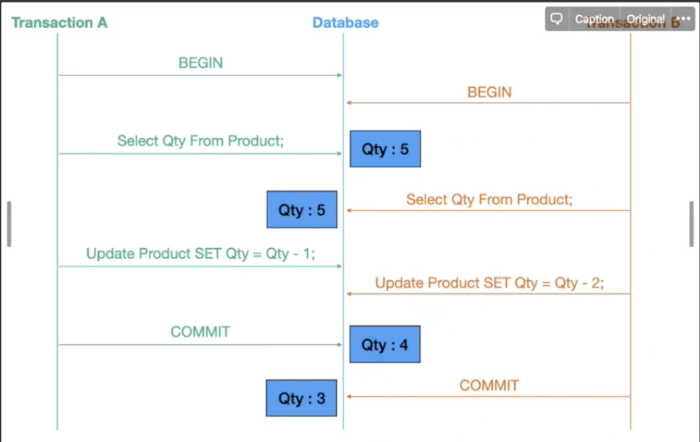

Qty 가 2가 나와야 하는데 3이 되었다.

## 낙관적 락


version 2 인 데이터가 없기 때문에 에러가 난다.

처음 트랜잭션만 성공하고 나머지 트랜잭션은 실패한다.

## 비관적 락


mysql 의 Select for update 사용.

pending 시간이 길면 latency 가 길어질 수 있다.

트랜잭션을 작게 잡아서 빠르게 커밋을 하고 테이블 락을 최대한 적게 가져가야 한다.

### 예제

사용할 함수에 `@Lock` 어노테이션을 붙여준다.

```java
@Lock(LockModeType.PESSIMITIC.WRITE)
@Transactional
public Optional<User> findById(Long id) {
  return repository.findById(id);
}
```
