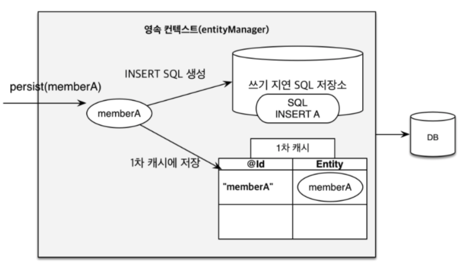

## JPA - 쓰기 쿼리는 언제 실행될까

JPA 에서 Insert 문을 호출할 때마다 Query 가 생성되서 바로 데이터베이스에 적용되지 않는다.

이것을 쓰기 지연이라 부르는데, 이유는 트랜잭션, 롤백과 관련이 있다. 그리고 이것이 가능한 근본적인 이유는 영속성 컨텍스트 덕분이다.



데이터베이스에 관련한 작업은 모두 영속성 컨텍스트에 기록이 된다.

memberA 와 memberB memberC 를 저장하는 코드가 아래와 같이 있다고 하자.

```java
em.persist(memberA);
em.persist(memberB);
em.persist(memberC);
```

그런데 하나 하나 `persist()` 가 호출될 때마다 디비에 쿼리가 전송이 된다 해도 그 내용은 실제로 적용되지 않는다.

왜냐면 어차피 트랜잭션 커밋이 되지 않았기 때문이다. 그렇다면 memberA 와 memberB 를 저장할 때 까지는 문제없이 잘 진행되다가

만약 memberC 를 저장할 때 문제가 생겼다면 쿼리는 데이터베이스에 memberA 와 memberB 를 저장하는 쿼리가 전송이 됬을거고 그것은 롤백이 되어 의미없는 코드가 되었을 것이다.

불필요한 네트워킹이 이루어 진것이다.

만약 `persist()` 가 호출될 때마다 디비에 전송하지 않고 어느 한 곳에 모아둔 후 마지막에 전송하면 어떨까? 그래도 결과는 같다는 것을 알 수 있다. 왜냐면 트랜잭션을 커밋해야 그 내용이 데이터베이스에 반영이 되는 구조이기 때문이다.

그런데 `find()` 와 같은 질의 메서드와 다르게 JPQL 은 즉시 데이터베이스이 쿼리를 전송한다. 따라서 이때는 자동으로 `flush()` 메소드가 호출이 된다.

만약 memberA 와 memberB 까지만 저장하고 member를 `find()` 를 통해 모두 조회해도 memberA 와 memberB 는 조회가 될 것이다.

그 이유는 영속성 컨텍스트에서만 조회를 하기 때문이다.

그리고 `flush()` 메소드는 디비에 쿼리만 전송을 하고, 실제 이것은 커밋이 된 것이 아니기 때문에 언제든 롤백이 될 수 있다.

## References

[자바 ORM 표준 JPA 프로그래밍](https://www.aladin.co.kr/shop/wproduct.aspx?itemid=62681446)
