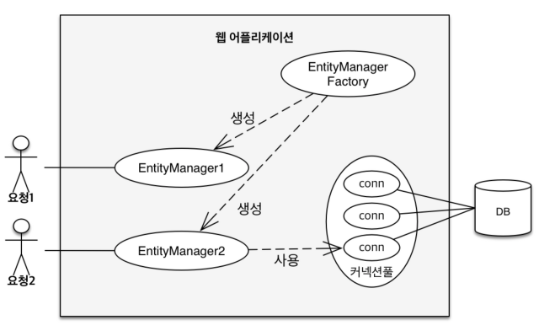
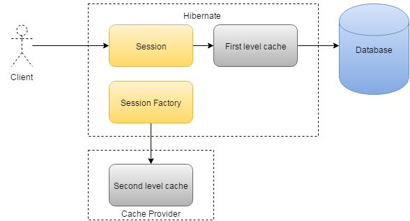
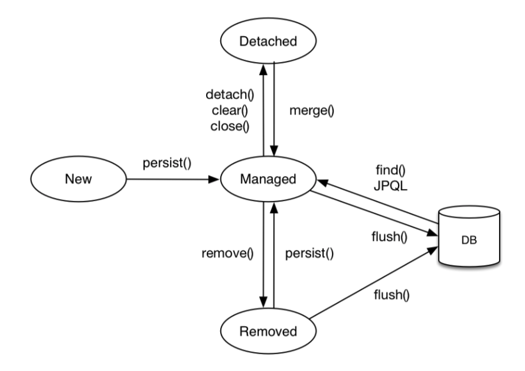

**영속성 컨텍스트**란 엔티티를 영구 저장하는 환경이다.

영속성 컨텍스트는 엔티티 매니저를 생성할 때 하나 만들어진다.

엔티티 매니저를 통해 영속성 컨텍스트에 접근할 수 있고 관리할 수 있다.

## 1. Entity Manager Factory 와 Entity Manager

엔티티 매니저 팩토리는 META-INF/persistence.xml 에 있는 정보를 바탕으로 생성된다.

엔티티 매니저 팩토리에서 엔티티 매니저를 생성한다. JPA 의 기능 대부분은 이 엔티티 매니저가 제공을 한다.



<span style="color:orange;font-weight:bold">엔티티 매니저를 사용해서 엔티티를 데이터베이스에 등록/수정/삭제/조회할 수 있다.</span>

엔티티 매니저는 <span style="color:orange;font-weight:bold">내부에 데이터소스(데이터베이스 커넥션)를 유지하면서 데이터베이스와 통신한다.</span> 따라서 애플리케이션 개발자는 엔티티 매니저를 가상의 데이터베이스라고 생각할 수 있다.

그리고 엔티티 매니저는 <span style="color:red;font-weight:bold">데이터베이스 커넥션과 밀접한 관계가 있으므로 스레드 간에 공유하거나 재사용하면 안 된다.</span>

데이터베이스를 하나만 사용하면 일반적으로 EntityManager Factory 를 하나만 생성한다.

사용이 끝난 엔티티 매니저는 `em.close()` 를 호출해 종료해야 한다.

그리고 애플리케이션이 종료될 때 엔티티 매니저 팩토리도 `emf.close()`를 호출해 종료해야 한다.

```java
// 공장 만들기, 비용이 아주 많이 든다.
EntityManagerFactory emf = Persistence.createEntityManager("jpabook");

// 비용이 거의 들지 않는다.
// Database connection 이 필요한 시점까지 디비 커넥션을 얻지 않는다.
EntityManager em = emf.createEntityManager();
```

Entity Manger Factory 를 생성하는 일은 비용이 크므로, 한 개만 만들어서 애플리케이션 전체에서 공유하도록 설계되어 있다. 반면에 그 공장에서 Entity Manager 를 생성하는 것은 비용이 거의 들지 않는다.

`EntityManagerFactory` 는 여러 스레드가 접근해도 안전하므로 스레드간 **공유해도 되지만**, `EntityManager` 는 여러 스레드가 접근하면 **동시성 문제**가 발생하므로 **스레드 간에 공유하면** 안 된다.

`EntityManager` 는 `Database connection` 이 필요한 시점까지 디비 커넥션을 얻지 않는다.

하이버네이트를 포함한 JPA 구현체들은 `EntityManagerFactory` 를 생성할 때 **커넥션 풀**도 만든다.

## 2. 영속성 컨텍스트의 특징

- 영속 상태는 식별자 값이 반드시 있어야 한다.
- 영속성 컨텍스트 내부에 Map 이 하나 있는데 `@Id` 로 매핑된 값이 키가 된다.
- JPA 는 보통 `Transacition commit` 시에 영속성 컨텍스트에 저장된 엔티티를 데이터베이스에 적용하는데 이것을 Flush 라고 한다.

## 3. 영속성 컨텍스트가 엔티티를 관리할 때의 장점

### 1. 캐시

`em.find()` 호출 시 캐시를 조회하고 없으면 DB 를 조회한다.

1. 1차 캐시 조회.
2. 2차 캐시 조회
3. 데이터베이스 조회



### 2. 동일성 보장

식별자가 같은 엔티티 인스턴스는 동일한 객체이다.

```java
Member member1 = em.find(Member.class, "member");
Member member2 = em.find(Member.class, "member");

assertTrue(member1 == member2); // 둘은 같은 인스턴스이다.
```

### 3. 트랜잭션을 지원하는 쓰기 지연

EntityManager 는 트랙젝션을 커밋하기 직전까지 디비에 반영하지 않고 `INSERT SQL` 을 모아두고 트랙잭션 커밋 시 모아둔 쿼리를 디비에 전송한다.

### 4. 변경 감지

JPA 는 변경감지(dirty checking)를 한다.

```java
EntityManager em = emf.createEntityManager();
EntityTransaction transaction = em.getTransaction();
transaction.begin();

Member memberA = em.find(Member.class, "memberA");

memberA.setUsername("Member A !!");
memberA.setAge(10);

// em.update(memberA) 이런 코드가 필요 없다.
transaction.commit();
```

### 5. 지연 로딩

JPA 는 엔티티를 영속성 컨텍스트에 보관할 때 최초 상태를 복사해 스냅샷을 만들어둔다.

그리고 플러시 시점에 스냅샷과 엔티티를 비교해 변경된 엔티티가 있다면 수정 쿼리를 생성해서 지연 SQL 저장소에 보낸다. 그리고 변경감지는 영속성 컨텍스트가 관리하는 영속 상태의 엔티티에만 적용된다.

이때, JPA 의 기본 전략은 모든 필드를 업데이트 하기 때문에 한 개의 필드만 바뀌더라도 모든 필드를 Update 하는 쿼리를 전송한다. 데이터 전송량이 증가한다는 단점은 있다. 장점은, 애플리케이션 로딩시점에 수정 쿼리를 미리 생성할 수 있고, 디비에 동일한 쿼리를 보내면 디비는 이전에 한 번 파싱한 쿼리를 재사용할 수 있다.

만약 필드가 너무 많거나 저장하는 내용이 너무 크면 동적으로 Update Sql 을 생성하는 전략을 사용해야한다.

```java
@Entity
@org.hibernate.annotations.DynamicUpdate
@Table(name = "Member")
public class Member {...}
```

이렇게 하면 수정된 데이터만 사용해 동적 UPDATE SQL 을 생성한다. 참고로 데이터를 저장할 때 데이터라 존재하는 (null 이 아닌) 필드만으로 INSERT SQL 을 생성하는 `@DynamicInsert` 도 있다.

## 4. Entity Life Cycle



- 비영속(new/transient): 영속성 컨텍스트와 관계가 전혀 없는 상태
- 영속(managed): 영속성 컨텍스트에 저장된 상태
- 준영속(detached): 영속성 컨텍스트에 저장되었다가 분리된 상태
- 삭제(removed): 삭제된 상태

### 비영속

```java
Member member = new Member();
member.setId("member1");
member.setUsername("user1");

// em.persist() 호출 전
```

위 객체는 순수한 객체다. em.persist() 를 호출 전 상태이므로 비영속 상태이다.

### 영속

```java
// 객체를 저장한 상태
em.persist(member);
```

엔티티 매니저를 통해서 엔티티를 영속성 컨텍스트에 저장했다.
`em.find()` 나 `JPQL` 을 사용해서 조회한 엔티티도 영속성 컨텍스트가 관리하는 영속 상태다.
**영속에서 중요한 개념은, 영속 상태란 것은 영속성 컨텍스트에 의해 관리 된다는 뜻이다.**

### 준영속

```java
em.detach(member);
```

**준영속 상태의 특징**

- 거의 비영속 상태에 가깝다.
  - 영속성 컨텍스트의 특징인 1차 캐시, 쓰기 지연 등이 동작 하지 않는다.
- 식별자 값을 가지고 있다.
  - 한 번 영속 상태인적이 있으므로 비영속 상태와 다르게 식별자 값이 반드시 있다.
- 지연 로딩을 할 수 없다.

> 영속 상태의 엔티티는 주로 영속성 컨텍스트가 종료되면서 준영속 상태가 된다. 개발자가 직접 준영속 상태로 만드는 일을 드물다.

### 영속성 컨텍스트 초기화

```java
em.clear();
```

`em.detach()` 메소드가 특정 엔티티 하나를 준영속 상태로 변경했다면 `em.clear()` 메소드는 해당 영속성 컨텍스트가 관리하는 모든 엔티티를 준영속 상태로 변경한다.

### 영속성 컨텍스트 종료

```java
em.close();
```

영속성 컨텍스트를 종료하면 해당 영속성 컨텍스트가 관리하던 영속 상태의 엔티티는 모두 준영속 상태가 된다.

### 병합

```java
em.merge(member);
```

준영속 혹은 비영속 상태의 엔티티를 다시 영속 상태로 변경하려면 병합을 사용하면 된다.

```java
/**
 * Merge Method 정의
*/
public <T> T merge(T entity);
```

`merge()` 메소드는 준영속 상태의 엔티티를 받아서 그 정보로 **새로운 영속 상태의 엔티티를 반환한다.**

병합은 준영속, 비영속을 따지지 않고 사용할 수 있다. 병합의 파라미터로 넘어온 엔티티의 식별자 값으로 영속성 컨텍스트를 조회하고 찾는 엔티티가 없으면 데이터베이스에서 조회한다. 만약 데이터베이스에서도 발견되지 않으면 새로운 엔티티를 생성해서 병합한다. 따라서 병합은 `save or update` 기능을 수행한다.

### 삭제

```java
em.remove(member);
```

엔티티를 영속성 컨텍스트와 데이터베이스에서 삭제한다.

## 5. Flush

플러시는 영속성 컨텍스트의 변경내용을 데이터베이스에 반영한다.

다음은 Flush 실행 시 Flow이다.

1. 변경 감지가 동작하여 스냅샷 비교후 UPDATE SQL 을 쓰기 지연 SQL 저장소에 등록.
2. 쓰기 지연 SQL 저장소의 쿼리를 데이터베이스에 전송.

영속성 컨텍스트를 플러시 하는 방법은 3가지다.

1. em.flush() 호출
2. Trsanction Commit
3. JPQL 쿼리 실행

### 직접 호출

엔티티 매니저의 `flush()` 메소드를 직접 호출해서 영속성 컨텍스트를 강제로 플러시한다. 테스트나 다른 프레임워크와 함께 JPA 를 사용할 때를 제외하고는 거의 사용하지 않는다.

### 트랜잭션 커밋 시 플러시 자동 호출

데이터베이스에 변경 내용을 SQL 로 전달하지 않고 트랜잭션만 커밋하면 어떤 데이터도 데이터베이스에 반영되지 않는다. 따라서 트랜잭션을 커밋하기 전에 꼭 플러시를 호출해서 영속성 컨텍스트의
변경 내용을 데이터베이스에 반영해야 한다. JPA 는 이런 문제를 예방하기 위해 트랜잭션을 커밋할 때 플러시를 자동으로 호출한다.

### JPQL 쿼리 실행 시 플러시 자동 호출

JPQL 이나 Criteria 같은 객체지향 쿼리를 호출할 때도 플러시가 실행된다. 그 이유를 아래 예제코드와 함께 알아보자.

```java
em.persist(memberA);
em.persist(memberB);
em.persist(memberC);

// 중간에 JPQL 실행
query = em.createQuery("select m from member", Member.class);
List<Member> members = query.getReusltList();
```

memberA, B, C 는 영속성 컨텍스트에는 존재하지만 실제 데이터베이스에는 반영되지 않았다.

그런데 JPQL 은 SQL 로 변환되어 데이터베이스에 쿼리로 바로 전송된다.

그래서 JPQL 에 memberA, B, C 를 제대로 반영하기 위해선

Flush 를 해서 현재 영속성 컨텍스트의 쓰기 저장소에 있는 쿼리를 실행할 수 밖에 없는 것이다.

따라서 JQPL 을 호출할 때 JPA 는 자동으로 `flush()` 를 호출한다.

## 6. 테스트 할 때 트랜잭션

테스트 클래스에 `@Transactional` 을 적용하면 테스트가 끝날 때 트랜잭션을 커밋하지 않고 강제로 롤백을 한다. 문제는 롤백시에 영속성 컨텍스트를 플러시 하지 않아 SQL Log 가 남지 않는다는 것이다. 따라서 테스트 마지막에 `em.flush()` 를 호출해주면 로그를 볼 수 있다.

## 7. 영속성 컨텍스트가 다를 때 엔티티 비교

`equals()` 를 사용해 동등성을 비교한다. 이때 비즈니스 키를 활용한 함수를 작성하는게 좋다.

## References

[자바 ORM 표준 JPA 프로그래밍](https://www.aladin.co.kr/shop/wproduct.aspx?itemid=62681446)

https://www.jcombat.com/hibernate/caching-in-hibernate
