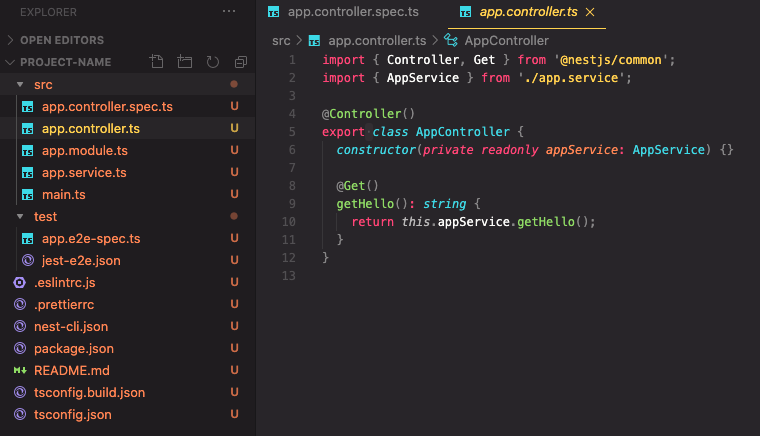
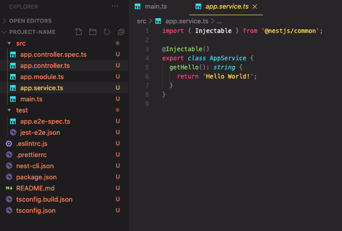
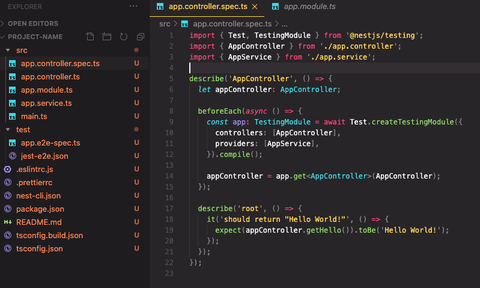
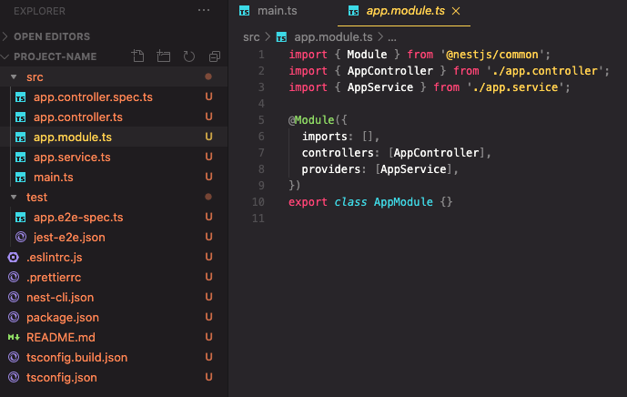

## 작성 계기

평소 Node.js 로 Server Side 를 개발하고 있는 와중 Nest.js 의 존재를 알게되고 사용해보며 좋음을 느껴 제대로 정리해보고자 함.
[공식문서](https://docs.nestjs.com/) 를 주로 참고해서 정리한다.

## NestJS 란?

Nestjs 는 효율적이고 확장 가능한 Node.js Server side application 이다.

특징으로, Typescript 을 완벽히 지원하고 OOP, FP, FRP 를 지원한다.

내부적으로는 다른 HTTP Framework 를 추상화 해서 사용하고 있다.

- [Express](https://expressjs.com/)
- [Fastify](https://www.fastify.io/)

등장하게 된 계기는, Front Level 에서는 React, Vue, Angular 3대장과 같은 좋은 프레임워크가 등장했는데

Node.js 진영에서는 아키텍처를 효과적으로 해결해주는 기술이 등장하지 않아 만들어졌다고 한다.

NestJS 는 AngularJS 개발자들이 만들었다. 따라서 비슷한 점이 많다.

## 시작

프로젝트 구성과 코드래벨에 대해서 아주 간단하게 알아보자.

우선 NestJS 는 CLI 를 매우 잘 지원한다.

```bash
$ npm i -g @nestjs/cli
$ nest new project-name
```

위 코드 만으로 프로젝트의 Boilerplate 및 구조가 생성이 된다.

밑에서 사진과 함께 코드 Level 을 살펴보자.


Controller 소스코드가 작성이 된다.

---


Serviec 소스코드가 작성이 된다.

---


Controller, Service Layer 에 대한 테스트코드 또한 작성이 된다.

---


Module 이란 것이 작성이 된다.

이곳에서 Dependency 를 주입해서 IOC / DI 를 구현한다.

---

## 기술적 지원 범위

- CLI: Boilerplate: 위에서 알아 봤듯이 편리하게 구성을 해준다.

- Architecture: Module, Controller, Service Layer 로 구성이 된다.

- Middleware

- Exception Filter

- Pipe: joi 나 class-validator 같은 서브파티 라이브러리를 사용해 validation 을 구성하기 쉽게 만들어져있다.
- Guard: Annotation 을 이용해 가드를 선언해 간단하게 보안 로직을 구성할 수 있다.
- Interceptor
- Custom Decorator
- Swagger: 코드 몇 줄만으로 모든 Controller 에 대한 API 문서화가 가능하다.
- 그외 각종 서드파티와의 결합 지원
  Graphql, Websocket, Redis, RabbitMQ, Kafka, gRPC, Passport 등.. 수많은 서드파티와의 결합을 손쉽게 제공한다.

## NestJS 장점

Express 에 비해 NestJS 는 Framework 단에서 구성해주는 것이 많다.

예를들어 Cli 를 사용하면, 코드 구조, Test Framework, Prettier, ESLint 를 생성해준다. 이것은 초기에 프로젝트를 구성할 때 비용을
줄여주고 편리하다.

Express 에 비해 코드 아키텍처가 정의 되어 있는 프레임워크이기에 유지부수에 용이할 것 같다.

Annotation 기반 프로젝트 구성이 가능해 코드를 깔끔하고 가독성 높게 유지할 수 있다.

DI 를 지원한다. OOP 코드를 구성하기 좋다.

서드파티와 결합의 지원이 좋다.

## NestJS 단점

추상화가 되어 구현이 되긴했지만 Express 를 Wrapping 해서 만들다보니 Nodejs 만의 가벼운 느낌이 사라졌다. 프로젝트가 좀 더 무거워진 느낌이 든다.

프레임워크에 대한 학습 비용이 있다.

코드 구성이 Strict 하게 구성이 되는데 이것은 Node.js 에서는 단점으로도 작용한다.

그리고 가장 중요한 Node.js 철학과 어울리지 않을 수 있다. 이것은 밑에서 자세히 알아보겠다.

## 결론: Node.js 철학

Node.js 의 기본철학은 간결함과 실용주의이다. OOP 를 구현하기 위해 필요한 수많은 비용을 지출하는 것은 Node.js 와 걸맞지 않다.

그런데 Nest.js 가 과연 Node.js 의 철학을 따라갈까라는 의문점이 든다. 왜냐면 NestJS 는 코드 구조가 Strict 하게 정해져 있고 OOP 적으로 코드를 구성하는 것과 흡사하기 때문이다.

우리는 완벽한 소프트웨어를 만드려고 노력하지만 실상 쉽지 않다. 시시각각 변화하는 세상을 복제해서 정적인 코드에 넣으려 하니 노력과 비용이 크다.

그래서 Node.js 는 합리적 수준의 복잡성을 갖고 빠르게 작업하기 위해 만들어졌다. 그래서 그 코어 또한 경량이며 각종 관련 오픈소스 모듈들도 경량이고 적은 코드만으로도 소프트웨어 개발이 가능하다.

그리고 Nest.js 코딩은 Java Spring 개발과 거의 흡사하며, 굳이 Node.js 로 이렇게 개발해야하나 싶기도하다. 그냥 간단히 Spring 쓰면 될 수도 있는데 말이다. 그래서 사람마다 이 기술에 대한 의견이 분분할 것 같기도 하다.

그럼에도 나는 "사용하고 싶다" 라고 생각이 들었다. 왜냐면,

Node.js 를 사용할 때 OOP 와 각종 디자인 패턴 등을 따라가는 것은 비용이 커서 Node.js 철학과 걸맞지 않지만, 그것을 다른 도구가 해주면 얘기가 달라진다.

최대한 그것을 편리하게 사용하게 해주는 프레임워크가 존재하고 그 프레임워크는 경량의 모듈과 결합을 손쉽게 해준다면 그것은 그것대로 사용하는 의미가 또 있다고 생각한다.

하지만 분명 안정성이 높고, 여러 사람이 참가하는 대규모 프로젝트에는 Spring 같은 것을 사용하겠지만. Nest.js 필요한 상황도 분명 있다고 생각한다.

그래도 Express 를 이용해 Inversity 라이브러리를 사용해 DI 를 구현하고, Lint 라이브러리 설치하고, 프로젝트 아키텍처 잡고... 등 프로젝트를 처음 시작할 때 번거로운 작업들을 해준다는 점은 매력적임에 틀림이 없다.

앞으로 나는 Node.js Server Side 를 다음과 같은 방식으로 개발할 것 같다.

Express 만 이용해 프로젝트 팀원끼리 Boilerplate 를 작성해 Convention 과 구조를 통일해 사용하거나

Nest.js 를 사용해 편하게 개발할 것 같다.
