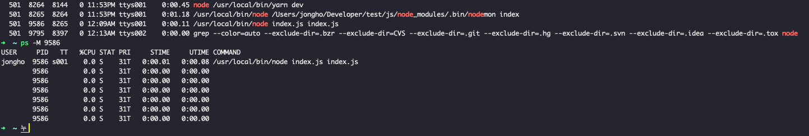

## Node.js

Node.js 는 같은 Cpu, Memory 환경에서 더 적은 리소스를 사용해 동시 요청을 처리하게 유리하다. 그 이유는 이벤루프라는 방식을 사용하기 때문이다.

하지만 **싱글 스레드**이니 **단일 콜스택**을 사용하기 때문에 Cpu Intensive 한 작업을 수행하기에는 속도가 느려질 수 있다.

Node.js 는 Javascript 의 Runtime 이다. 브라우저에서 쓰이는 경우 부터 알아보자.

## 브라우저 환경


JS Engine 은 **Memory Heap** 과 **Call Stack** 으로 구성되어 있다. 가장 유명한 것이 구글의 **V8 Engine** 이다.

**V8 Engine 을 사용하면**, 자바스크립트는 단일 스레드(single thread) 로 작동한다.

_자바스크립트 언어가 단일 스레드인 것이 아니다. 자바스크립트의 Popular 한 Runtime Environment 환경이 Browser 와 Node.js 인 것뿐이다._

### Web API

---

Web API 는 JS Engine 과 관련이 없다. 브라우저에서 제공하는 API 일 뿐이다.

Call Stack 에서 실행된 비동기 함수는 Web API 를 호출하고, Web API 는 콜백함수를 Callback Queue 에 밀어 넣는다.

### Callback Queue

---

**비동기적으로 실행된 콜백함수**가 보관되는 영역이다.

예를들어 setTimeout 에서 타이머 완료 후 실행되는 함수, addEventListener 에서 click 이벤트가 발생했을 때 실행되는 함수 등이 보관된다.

### Event Loop

---

Event Loop 는 Call Stack 과 Callback Queue 의 상태를 체크하여,

Call Stack 이 빈 상태가 되면, **Callback Queue 의 첫번째 콜백을 Call Stack 으로 밀어넣는다.**

이러한 반복적인 행동을 틱(Tick) 이라 부른다.

## Task Queue, MicroTask Queue, Animation Frames

---


좀 더 구체적으로 접근해보자. Promise 는 **Microtask Queue** 로 들어가고 requestAnimationFrame 은 **Animation Frames** 에 들어가고 setTimeout 같은 API 는 **Task Queue** 로 들어간다.

실행 순서는 Microtask Queue > Animation Frames > Task Queue 이다.

## Node.js 환경


Node.js 에서는 Libuv 라는 라이브러리가 이벤트루프 역할을 한다.

여러 Request 가 들어왔다고 생각해보자. 평범한 함수는 V8 Engine 의 Call Stack 영역에서 처리된다. 그리고 비동기 API 는 Worker Thread 에서 실행되고 콜백함수를 Event Queue 에 넣는다. Worker Thread 에서 비동기 작업이 실행이 실행이 되고 이벤트 루프는 그것이 끝난지를 계속해서 확인한다. 작업이 끝난 것이 확인됬고 콜스택이 비어있으면 Event Queue 에 있는 것을 콜스택 영역에 넣어, 콜스택 영역에서 실행이 끝나면 그 Task 를 콜스택에서 제거하고 Event Queue 에서 제거한다.

### Worker Thread

Libuv 모듈은 내부적으로 Thread Pool 을 두어서 Worker Thread 를 미리 생성해둔다. Worker Thread 를 생성하는 것은 OS Level Thread 보다 무거운 작업이고, 오히려 Mini Process 와 유사하다.

그 이유는, Worker Thread 를 생성할 때 새로운 Javascript VM, Global Context, Heap, Garbage Collector 를 생성하며 메모리를 약간 할당해주기 때문이다.

쓰레드끼리 일반적인 변수는 공유하지 않고 Shared Memory 라는 것을 공유한다. 이것은 워커 쓰레드 끼리도 공유 되며 메인 쓰레드와도 공유가 된다. 각각의 쓰레드는 메시지를 통해 통신할 수 있다.



```javascript
const http = require('http')

http
  .createServer(function(req, res) {
    res.writeHead(200)
  })
  .listen(8000, function() {})
```

위 코드를 통해 서버를 생성했다.

그리고 위 사진을 보면 총 7개 의 Thread 가 떠있는 것을 볼 수 잇다. 맨위에 한 개는 Main Thread 도 그 밑에 6개가 Worker Thread 인걸로 짐작이 간다.

## 비동기 논블로킹

여러 개의 Request 가 들어올 때 Node.js 는 이벤트 루프 방식을 사용한다. IO 요청이 들어오면 그것을 Worker Thread 에게 넘기고 다른 요청을 처리한다. 따라서 하나의 메인 쓰레드를 효율적으로 사용할 수 있다.

자바는 멀티 쓰레드 프로그래밍을 자주 사용한다. 스프링에서 일반적인 방식인, 동기 블로킹과 같은 방식으로 Request 를 처리하게 되면, Request 수 당 쓰레드 하나가 그것을 맡게된다. 따라서 그 하나의 요청이 IO 를 수행하게 되면 그 쓰레드는 계속해서 그 IO 를 기다리게 되는 비효율성이 발생하게 된다. 그리고 쓰레드 풀 수를 넘어선 Request 가 들어오면 그 부분이 병목현상이 될 수 있다.

따라서 Node.js 는 싱글 스레드로, **적은 Cpu 와 Memory 자원**으로 **시간 당 트랜잭션**이 많은 경우 높은 효율을 가질 수 있지만. 단점은 단일 콜스택을 사용하기 때문에 Cpu Intensive 한 작업을 처리하게 되면 다른 Request 의 대기시간이 길어져 전체 요청 시간의 합은 길어질 수 있다. (그래서 Crypto 같은 Cpu Intensive 한 라이브러리에서는 Async 방식도 Optional 하게 제공하는 것 같다.)

## 그래서 결국 자바스크립트는 싱글 스레드언어일까?

자바스크립트 언어가 단일 스레드인 것이 아니다. 자바스크립트의 Popular 한 Runtime Environment 환경이 Browser 와 Node.js 인 것뿐이다.
[출처](https://stackoverflow.com/questions/63224356/is-node-js-considered-multithreading-with-worker-threads)

> First off, there's nothing inherent in the JavaScript language specification that requires single threaded. The single-threaded programming model is a product of how the JavaScript language is implemented in the popular programming environments such as Node.js and the browser. So, when speaking about single-threadedness, you should speak about the programming environment (such as Node.js), not about the language itself.

## References

[Event Loop (이벤트 루프)](https://velog.io/@thms200/Event-Loop-%EC%9D%B4%EB%B2%A4%ED%8A%B8-%EB%A3%A8%ED%94%84)

[자바스크립트 비동기 처리 과정과 RxJS Scheduler](http://sculove.github.io/blog/2018/01/18/javascriptflow/)

[자바스크립트와 이벤트 루프 : TOAST Meetup](https://meetup.toast.com/posts/89)

[Is Node.js considered multithreading with worker threads?](https://stackoverflow.com/questions/63224356/is-node-js-considered-multithreading-with-worker-threads)

[OKKY | Node의 IO처리가 worker에 의한 멀티쓰레드 방식이라면, 자바의 멀티쓰레드 방식과 무엇이 다른건가요?](https://okky.kr/article/710446)

[Java vs Nodejs](https://belitsoft.com/java-development-services/java-vs-nodejs)
