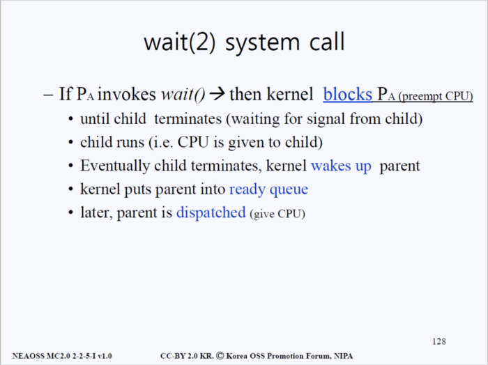
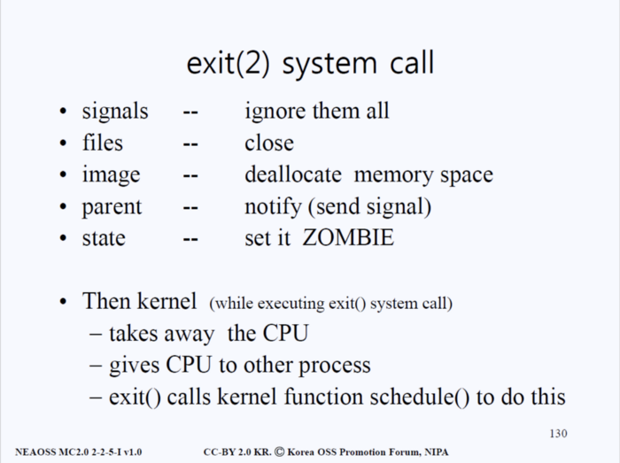
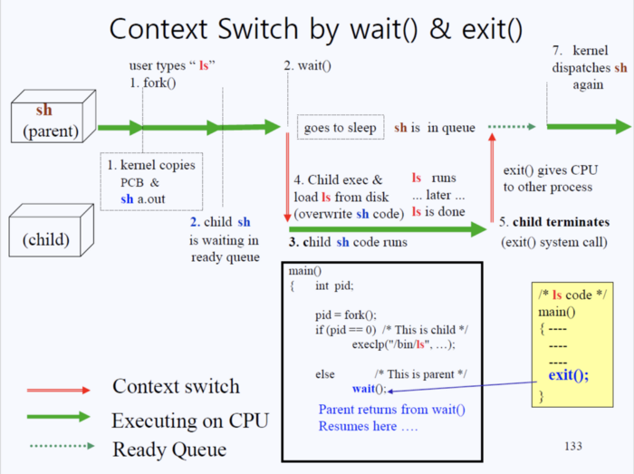

프로세스는 프로세스에 의해 만들어진다. 즉 부모 프로세스에 의해 만들어진다고 할 수 있다.

프로세스는 구조 형태는 트리 형태이다. 모든 프로세스들은 Parent 와 Child Process 를 가진다.

## 최초의 부모 process 는 언제 생성될까?

Main Memory에 OS가 올라갈 때 생성된다.

PID 가 0인 부모 / Swapper 프로세스는 부모가 존재하지 않고 lilo 등에 의해서 수동으로 실행이 된다. 나머지 프로세스들은 모두 `fork()` 시스템 콜과 `exec()` 시스템 콜을 이용해서 생성이 된다.

> 부모의 PID 는 PPID 라고도 한다.

> 부모가 같은 자식 프로세스들은 Sibling Process 라고 한다.

## fork() 시스템콜

`fork()` 시스템콜은, 새로운 프로세스를 위한 **메모리를 할당**한다. 그리고 `fork()` 함수를 호출한 프로세스를 새로 할당한 메모리에 복사한다. 따라서 복사된 프로세스는 호출한 프로세스와 **PID** 만 다를뿐 같은 코드(image)와 PCB 를 가지게 된다.

```c
main()
{
  int pid;
  pid = fork();
  if (pid == 0)
    printf("child process\n");
  else
    printf("parent process\n");
}
```

결과는 다음과 같다.

```bash
parent process
child process
```

Fork 함수는 두번 리턴된다. 한 번은 부모 프로세스에게 자식 프로세스의 아이디 값을 리턴하고 한 번은 자식 프로세스에게 0을 리턴한다.

처음엔 아직 부모 프로세스가 CPU를 점유하고 있는 상태이기 때문에 fork()로부터 리턴된 pid 값은 자식 프로세스의 pid 값이어서 else 문을 타고, 이후 자식 프로세스의 pid 값을 리턴 받음으로써 부모 프로세스는 자식 프로세스를 알고 통제할 수 있는 것이다.

그리고 부모로부터 복제된 자식 프로세스는 **ready queue** 에서 CPU 가 자신에게 할당되기를 기다리고 할당이 되면, CPU 점유권을 얻게 되고.

자식 프로세스는 **PCB** 또한 복사햇기 때문에 어디서부터 코드를 실행해야할지 알려주는 **PC** 와 **SP** 를 참고하여 맨처음부터 실행하는 것이 아니라, `fork()` 중간에서 부터 다시 코드를 실행하게 된다.

## exec() 시스템콜

`exec()` 시스템콜은 `fork()` 시스템콜처럼 새로운 **메모리를 할당하지 않고**

`exec()` 함수를 호출한 프로세스의 메모리에 **새로운 프로세스를 덮어 씌운다.**

따라서 기존에 있던 시스템콜을 호출한 프로세스는 사라지고 새로운 프로세스만 남게 된다.

새로운 프로세스가 생기는 것이 아니기 때문에 **PID** 는 유지가 된다.

```c
main() {
  int pid;
  pid = fork();
  if (pid == 0) {
    printf("Child Process\n");
    execlp("/bin/date", "bin/date", (char *) 0);
  } else {
    /* Parent Code */
  }
}
```

**PCB**와 소스코드 전부를 복사해오는 `fork()` 함수와 달리, `exec()` 함수는 새로운 실행 코드를 디스크로부터 바이너리 파일 형태로 가져온 후 덮어 씌운다.

위의 예제의 경우 /bin 경로에서 date 를 load 한 후 그 코드의 `main()` 함수를 실행하는 것이 `exec()` 함수의 역할이라고 할 수 있다.

## wait() 시스템콜



간단히 말하면, `wait()` 시스템콜을 호출하면 호출한 프로세스(부모 프로세스)는 잠들게 된다. 그리고 자식 프로세스가 끝나거나 시그널 함수가 호출이 되면 깨어난다.

구체적으로 말하면, `wait()` 시스템콜을 호출되면 호출한 부모 프로세스로부터 CPU를 점유권을 빼앗는다. 그후 부모 프로세스는 **Readay Queue** 에서 제거된다.

커널은 보통 자신의 작업을 마치고 자신을 호출한 프로세스의 유저 모드로 돌아가야 하는데, `wait()` 함수가 실행될 경우 돌아가지 않는다.

커널이 아닌 프로그램은 자신의 주소에 한정되어서 read, jump 등을 할 수 있지만 Kernel은 어디든 점프하며 read를 할 수 있다.

그래서 `wait()` 함수가 호출이 되고 나서 **Ready Queue** 에서 우선순위가 가장 높은 Program 의 **PCB** 를 찾아서 **PC(Program Counter)** 를 알아낸 후에 **PC**가 가리키는 곳으로 Jump 한다. 이 과정을 [**preempt**](<https://en.wikipedia.org/wiki/Preemption_(computing)>)라고 부른다.

자식 프로세스가 종료되면, CPU는 자식 프로세스로부터 부모 프로세스를 찾아 다시 **Ready Queue** 에 등록시킨다.

이후 부모 프로세스가 CPU 점유권을 받으면 wait() 시스템 콜이 끝나게 된다.

> `wait()` 함수에는 정상적으로 child process 가 종료되었는지 혹은 어떤 문제가 생겨서 종료되었는지를 알 수 있는 exit_code field 가 존재한다. (/include/sys/wait.h)

## exit() 시스템콜

메인함수 `main()`가 끝날 때는 반드시 exit(2) 시스템콜이 호출된다. 설령 우리가 소스코드 파일에 적지 않아도 컴파일러가 마지막에 삽입해준다.



- 들어오는 신호를 모두 무시한다.
- 파일들이 열려 있다면 닫는다.
- memory 를 deallocate 한다.
- 부모에게 시그날을 보낸다.
- exit() 시스템콜을 호출한 프로세스를 좀비상태로 설정한다.

## Context Switch



1. 유저가 `Shell` 에서 `ls` 릅 이력한다. 쉘은 프로세스를 실행시키기 위해 `fork()` 함수를 실행시킨다. 커널은 `Shell`의 PCB 와 `a.out`(코드) 을 복사해서 자식 프로세스를 만든다.
2. 아직 부모 프로세스가 `wait()` 함수를 호출하지 않았기 때문에 **Ready Queue** 에서 기다린다. 그리고 부모 프로세스가 `wait()` 함수를 호출하면 Shell (부모 프로세스)은 sleep 상태가 되고 Ready Queue 에 들어간다.
3. 자식 프로세스는 PCB 를 부모 프로세스와 공유했기 때문에 `fork()` 중간 코드에서 실행을 시작한다. `fork()` 함수로부터 리턴된 값은 자식프로세스 값을 뜻하는 0이므로 `execlp("bin/ls", ...)`를 실행한다.
4. 디스크로부터 /bin 경로에 있는 ls 를 로드해서 자식 프로세스에 덮어 씌운다.(overwrite) 그후 ls 의 메인 코드로가서 코드를 실행한다.
5. `ls` 실행이 종료되면 exit(2) 시스템 콜을 호출하고 다시 커널 모드로 돌아와서 다른 프로세스에게 CPU에게 점유권을 넘긴다.
6. 높은 우선순위를 가지고 기다리던 프로세스가 없다면, 기존의 부모 프로세스는 다시 실행된다.

## References

http://www.kocw.net/home/search/kemView.do?kemId=978503

https://talkingaboutme.tistory.com/entry/Process-Process-Creation

https://medium.com/pocs/%EB%A6%AC%EB%88%85%EC%8A%A4-%EC%BB%A4%EB%84%90-%EC%9A%B4%EC%98%81%EC%B2%B4%EC%A0%9C-%EA%B0%95%EC%9D%98%EB%85%B8%ED%8A%B8-3-9ed24cf457ce
