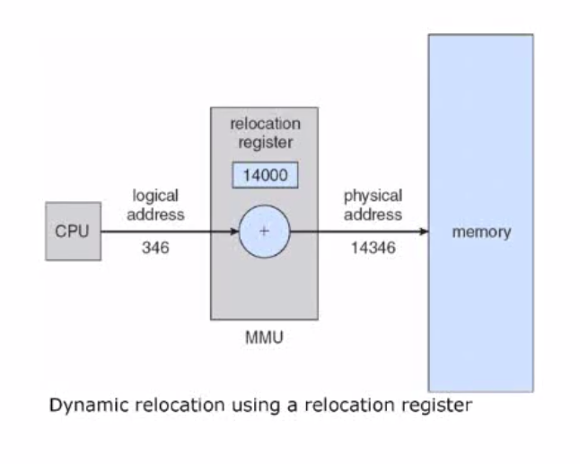

메모리는 언제나 부족하다. 어떻게 하면 메모리를 효과적으로 사용할 수 있을까?

- 메모리 낭비 없애기
- 가상 메모리 (virtual memory)

## 프로그램을 메모리에 올리기

### 메모리 구조

- 주소(Address) + 데이터(Data)

### 프로그램 개발

- 원천파일 (Source file): 고수준언어 또는 어셈블리언어
- 목적파일 (Object file): 컴파일 또는 어셈블 결과
- 실행파일 (Excutable file): 링크 결과

Source file 은 Compiler 에 의해서 Compile 되어 Object file 이 된다. 이것은 기계어이다.

하지만 Object file 은 다른 라이브러리에 대한 기계어와 OS 와 하드웨어와 상호작용하기 위한 스타트업코드가 포함되어 있지 않다.

그래서 그것들은 연결해주는 Linker 가 Link 를 하면 Excutable File 이 되어 실행가능한 상태가 된다.

그 실행가능한 파일은 Loader 로 Main Memory 에 올리면 Process 가 된다.

프로그램이 실행된 상태가 되면, 원래의 프로그램과 다르게 프로세스로서 Code + Data + Stack 의 구조를 갖게 된다.

### 실행파일을 메모리에 올리기

우리는 다중 프로그래밍 환경에서 사용할 프로그램을 개발하기 때문에 자신이 항상 고정된 번지의 주소를 사용할 수 없다.

그래서 MMU 를 사용해서 메모리 번지를 재조정한다.

CPU 는 Logical Address 만 참조한다. [Logical Address](https://en.wikipedia.org/wiki/Logical_address) 란 CPU 에 의해서 생성되는 주소체계로, 실제 물리적 메모리 주소와는 상이할 수 있다.

위 사진처럼 CPU 는 346번지를 호출해도 중간에 있는 MMU(Memory Management Uit)이 Relocation Register 를 이용해 14000 이라는 값을 더해서 실제 물리적 주소에 매핑해준다. 실제 물리적 주소는 **Physical Address** 라고 한다.

## References

http://www.kocw.net/home/search/kemView.do?kemId=978503

http://contents.kocw.or.kr/KOCW/document/2013/kyungsung/yangheejae/os04.pdf

https://ugong2san.tistory.com/2216
