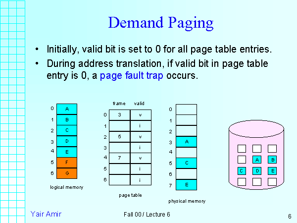

만약 100MB 메인 메모리에서 200MB 크기의 프로세스를 실행하려한다면 어떻게 해야할까?

가상 메모리란 이러한 물리 메모리 크기 한계를 극복하기 위한 방법이다.

프로세스 이미지를 모두 메모리에 올리지 않고 페이지로 나누어서 현재 실행에 필요한 부분만 메모리에 올리는 것이다.

> 동적 적재처럼 실행에 필요한 것만 메모리에 올린다는 개념은 비슷하다.

## Difference between dynamic loading and demand paging

[스텍오버플로](https://stackoverflow.com/questions/59786237/difference-between-dynamic-loading-and-demand-paging#:~:text=Dynamic%20loading%20is%20the%20mechanism,They%20serve%20different%20purposes.)를 참고하자.

**Dynamic Loading** 은 Runetime 에 Binary 를 Load 하는 Mechanism 이다.

**Demand Paging** 은 오직 필요할 때만 그 Page 를 Load 하는 최적화 기법이다.

둘 다 모두 Lazy Loading 을 사용한다는 점에선 같다.

## Demand Paging

**Demand Paging** 이란 Virtual Memory 에서 사용되는 방법이다.

**Demand Paging** 은 다음과 같은 방법으로 동작한다.

- 프로세스 이미지를 Backing Store 에 저장한다.
- Paging 방법으로 프로세스를 페이지 단위로 나눈다.
- 지금 필요한 페이지만 메모리에 Load 한다.

### Page Fault, Valid Bit

CPU 가 메모리에 접근하기 위해선 Page Table 에 접근을 먼저 하게 된다.

이때 Demand Paging 에 의해서 현재 사용중인 혹은 Prepared 된 프로세스의 페이지만 메모리에 올라가있을 것이다.

그러므로 CPU 가 메모리에 접근을 할 때 해당 주소가 메인 메모리에 올라와있지 않을 수 있다. (Page Fault)

그래서 다음 사진과 같이 Page Table 에 메모리 번호를 기록하는 Frame 외에 **Valid** 라는 Bit 를 둔다. 그리고 해당 값이 1이면 현재 메모리에 올라와 있는 프로세스인 것이고, 0이면 현재 메모리에 없고 **Backing store(=swap device)** 에서 가져와함을 의미한다.

따라서 CPU 가 접근을 할 때 Invalid 하다면(Page Fault), Page Table 에서 CPU 로 Interrupt 를 보낸다. 그리고 CPU 는 OS 의 handling a page fault routine 으로 점프한다. [참고](http://faculty.salina.k-state.edu/tim/ossg/Memory/virt_mem/page_fault.html)

그 Page Fault Routine 에서, 해당 프로세스의 페이지를 **Backing store** 에서 찾아서 메모리에 로드해주고, 그 메모리의 프레임 번호를 페이지 테이블에 기록하며 Valid Bit 도 1로 수정해준다. 그리고 CPU 는 그 값을 읽게 되는 것이다.

다음과 같이 당장 필요한 프로세스만 메모리에 올려서, 메모리 절약을 할 수 있지만. CPU로 하여금 메모리에 접근할 때 더 일련의 과정을 거치게 되어 속도 저하는 있을 수 있다.

## Pure Demand Paging vs Prepaging

### Pure Demand

**Pure Demand Paging** 이란 Program 을 Load 할 떄 아무 페이지도 메모리에 올리지 않는 것이다. 그러면 실행이 되면서 계속해서 메모리에 프로세스가 올라오게 될 것이다.

따라서 위 방식은 메모리 절약이 많이 되지만 속도가 느릴 것이다.

### Prepaging

prepaging 은 당장 필요 안 해도 미리 준비해두는 것이다. 따라서 메모리는 좀 낭비될 수 있어도, 속도가 빠를 수 있다.

## Swapping vs Demand Paging

Swapping 과 Demand Paging 모두 Process 를 Backing Store 에 두고 다시 메모리로 올린다는 점에선 같다.

하지만 그 차이점을 살펴보면

**Swapping** 은 Memory 와 Backing store 를 왔다갔다하는 단위가 **프로세스 전체**이고

**Demand paging** 은 Memory 와 Backing store 이동하는 단위가 **페이지**로, 더 작다.

## 유효 접근 시간(Effective Access Time)

### Effective Access Time

- p: probability of a page fault = page fault rate
- Teff = (1-p) \* Tm + p \* Tp

### 예제

- Tm = 200 nsec (DRAM)
- Tp = 8msec (seek time + rotational delay + transfer time)
- Teff = (1-p) \*200 + p 8,000,000 = 200 + 7,999,800p

Effective Access Time 은 따라서 200 + 7,999,800p 가 되는데

만약 Page Fault Rate 가 1/1000 라면 Teff = 8.2usec 으로, 원래 메모리 접근 시간보다 40배 느리다.

40배는 너무 느리고, 우리는 10% 정도까지는 감안할 수 있다. 10% 느린 값이 나오려면 확률은 1/399,990이 되어야 한다.

거의 40만번에 한 번 페이지 폴트가 일어나야 하는 것이다.

Page Fault 가 일어날 때 Process 가 메모리를 찾아가는데 걸리는 시간이 저렇게 긴 이유가 뭘까?

seek time + rotational delay + transfer time 을 살펴보자.

transfer time 은 단순히 전기 신호가 오가는 것이어서 매우 빠르다.

[rotational delay](https://www.computerhope.com/jargon/r/rotadela.htm#:~:text=A%20rotational%20delay%20is%20the,referred%20to%20as%20rotational%20latency.)도 또한 빠르다.

seek time 은 하드 디스크를 탐색하는 것이다. 따라서 이곳에서 시간이 많이 걸린다.

하드디스크, 즉 Backing Store(=Swap device) 에서 해당 Process 를 찾는데 시간이 걸리는 것이다.

그래서 Backing Store 를 Flash Memory 나 SSD 와 같은 디스크에 두면 좋을 것이다.

## 지역성의 원리

### Locality of reference

- 메모리 접근은 시간적, 공간적 지역성을 갖는다.
- 실제 페이지 부재 확률은 매우 낮다.

메모리 접근은 인근에 있는 것이 다시 바로 접근될 확률이 높다. 우리는 반복문을 많이 사용하니까.

Page Fault 가 일어날 때 Block 단위로 프로세스를 들고온다.

## References

http://www.kocw.net/home/search/kemView.do?kemId=978503

http://contents.kocw.or.kr/KOCW/document/2013/kyungsung/yangheejae/os05.pdf

https://www.cs.jhu.edu/~yairamir/cs418/os6/sld006.htm
