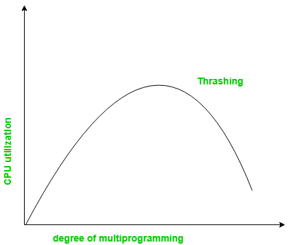
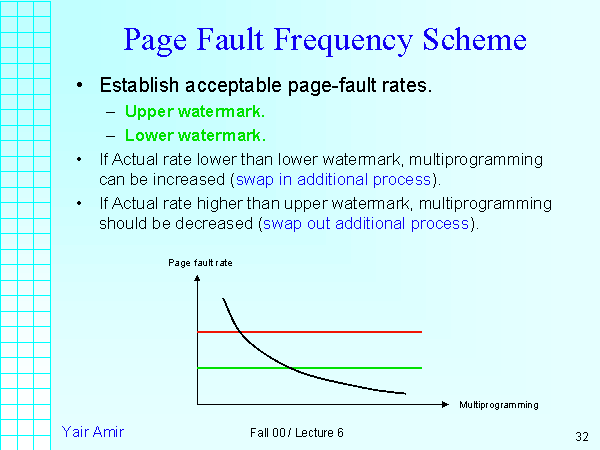

## 쓰레싱 (Thrashing)

쓰레싱이란 메모리에 접근할 때 페이지 폴트(Page Fault)율이 높은 것을 의미한다.

### CPU Utilization vs Degree of multiprogramming

기본적으로는 프로세스가 개수 증가하면 CPU 이용률 증가하다가, 일정 범위를 넘어서면 CPU 이용률이 감소한다.

그 이유는 Page Fault 가 빈번하게 발생하며 Page-in/out 이 증가하기 때문이다.

### 쓰레싱 원인

운영체제는 CPU 이용률을 감시하면, CPU 이용률이 너무 낮아지면 새로운 프로세스를 시스템에 더 추가해서 다중 프로그래밍을 높인다. 이때 전역 페이지 교체(Global Replacement) 알고리즘을 사용해서 어떤 프로세스의 페이지인지에 대한 교려 없이 교체를 수행한다.

어떤 프로세스가 새로운 실행단계로 진입함에 따라 페이지 폴트가 발생하게 된다면, 다른 프로세스의 페이지를 page-out 시켜서 프레임을 가져와 실행할 것이다. 그리고 Context Switching 이 되면서 다른 프로세스가 실행될 때 금방 page-out 된 프로세스가 필요한 프로세스였다면 다시 페이지 폴트가 발생하고 또 다른 프로세스의 프레임을 가져올 것이다. 이러한 작업이 반복되다보면 CPU 이용률이 떨어질 것이다. 그리고 이것을 감시하던 CPU 스케쥴러는 이용률을 높이기 위해 새로운 프로세스를 추가해서 다중 프로그래밍의 정도(Degree of multiprogramming)를 높일 것이다. 그러면서 새로운 프로세스들은 실행중인 프로세스들로부터 프레임을 더 가져오려고 하면서 더 많은 페이징 폴트와 IO 가 발생할 것이다.

### 쓰레싱 극복

쓰레싱을 해결하기 위한 방법을 알아보자.

- Global replacement 보다는 Local Replacement 를 이용하는 것이 좋다. 위에서 알아봤듯이 다른 프로세스의 프레임을 가져오면 다시 페이지 폴트가 발생할 수 있기 때문이다.
- 각 프로세스가 필요로하는 프레임의 개수를 보장해주어야 한다.
- 프로세스마다 프레임을 적절히 분배해야 한다.

프레임을 적절히 분배하려면 어떻게 해야할까? 아래에서 알아보자.

## Allocation of frames

Frame 할당 방식에는 Static Allocation 과 Dynamic Allocation 이 있다. 이 두개에 대해서 알아보자.

## Static Allocation

Static Allocation 에는 Equal allocation 과 Proportional allocation 이 있다.

### Equal allocation

각 프로세스들이 같은 수의 Frame 을 갖게 된다.

하지만, 같은 양의 프레임을 할당 받다보니, 메모리를 적게 필요로 하는 프로세스가 자기의 필요보다 많은 프레임을 할당받아 낭비가 생길 수 있다.

ex ) PPT 와 메모장이 있고. 메모리 프레임이 10개가 있다고 하자.

그러면 PPT 도 메모장도 5개의 프레임을 나눠주는 방법이다.

### Proportional allocation

각각의 프로세스 사이즈에 맞추어서 프레임을 할당해주는 방식이다.

Equal allocation 에 비해서 자기가 필요한 만큼의 프레임만 할당받을 수 있어서 낭비가 줄어든다.

ex ) PPT 와 메모장이 있고. 메모리 프레임이 10개가 있다고 하자.

메모장 프로세스는 프로세스 크기가 작고, PPT 는 프로세스 크기가 크다.

따라서 PPT 는 8개, 메모장은 2개만 나눠준다.

## Static Allocation vs Dynamic Allocation

앞에서 Static Allocation 을 살펴봤다. 해당 프로세스의 사이즈만 보고 프레임을 나눠주기엔 문제가 있다. 해당 프로세스가 제공하는 모든 기능(코드)을 사용하지 않을 수 있기 때문이다. 이것은 실행하기 전까지는 모를 것이다. 그래서 **동적 할당(Dynamic Allocation)**을 많이 사용한다.

## Dynamic Allocation

### Working set model

- Locality: 페이지들이 모여있는 것 (Cpu 가 내는 주소는 모여져있다.)
- Working set: 과거 일정 시간대에 사용된 페이지
- Working set window(=Δ): 현 시점을 기준으로 얼마를 과거로 보는지에 대한 시간

Working set model 은 과거의 어떤 시간 동안 얼만큼의 페이지가 프레임에 할당되었는지를 보고 이번에 할당할 프레임 수를 정하는 방법이다.

이때 얼만큼의 과거를 볼지를 정하는 것을 Working set window 라고 한다.

> Locality 만큼 할당하면 좋겠지만, 미래의 Locality 를 알 수 없기때문애 과거의 참조했던 페이지를 참고해서 프레임을 할당한다.

### Page Fault Frequency (PFF)

Page Fault 발생 비율에 대한 상한/하한선을 정해둔다.

상한선을 초과하는 프로세스에는 더 많은 프레임을 할당하고

하한선 이하의 프로세스에든 더 적은 프레임을 할당한다.

## References

http://www.kocw.net/home/search/kemView.do?kemId=978503

http://contents.kocw.or.kr/KOCW/document/2013/kyungsung/yangheejae/os05.pdf

https://velog.io/@zehye/%ED%94%84%EB%A0%88%EC%9E%84-%ED%95%A0%EB%8B%B9Allocation-of-Frames

https://www.cs.jhu.edu/~yairamir/cs418/os6/sld032.htm
