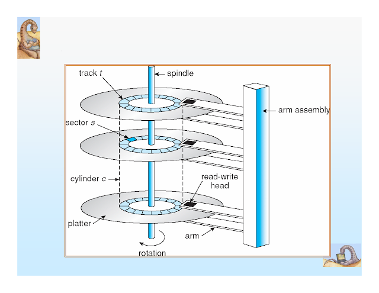
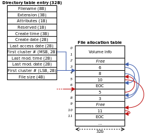
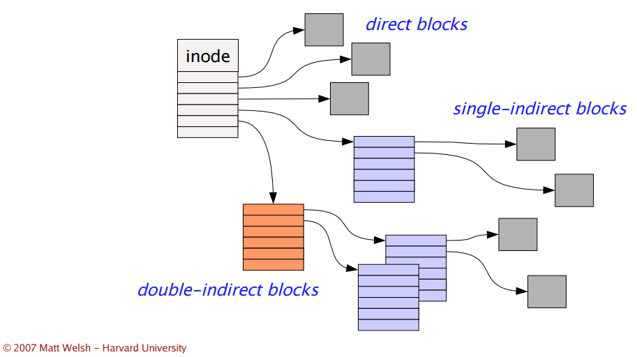

## 하드 디스크 구조

원판에 자성물질을 달려있고 모터가 돌고있다.

데이터는 동심원 상에 저장된다.

디스크 헤더가 있고 코일이 담겨 있다.

코일에 전기를 흘리면 밑에 원판이 자화가 된다. 전기를 어느 방향으로 흘리는가에 따라서 N 극 S 극 설정을 함으로써 쓰기(write)를 한다.

읽을(read) 때는 판을 돌려서 전기를 발생시켜 그 값을 읽어드린다.

Track 을 자르고 그것 하나하나를 Sector 라고 한다.

하드 디스크 판을 여러개 넣을수도 있는데 판 앞쪽에도 기록할 수 있고 뒷쪽에도 기록할 수 있다.

같은 거리에 있는 트랙들의 집합을 Cylinder 라고 한다.

섹터를 모아둔것을 블락이라고 한다.

블록은 보통 512 Byte 인데 너무 작아서 하드 디스크를 읽고 쓸때는 블록 단위로 불러온다. 따라서 Block Device 라고도 부린다.

> 반대는 캐릭터 디바이스다. 대표적으로 키보드가 있다. (글자 단위로 이동)

블록을 너무 작게하면 여러번 IO 를 해야하기 때문에 효율이 안 좋다.

> [Page Size](</os/os-(20)-page-size/>)에서 언급한 것과 비슷하다.

하지만 너무 크면 작은 데이터를 불러올 때 많은 양을 읽어와야해서 용량면에서 효율적이지 않다. 이것들은 OS 설계자가 결정한다.

disk = pool of free blocks

어떻게 블록에 할당을 할까? disk 용량을 효과적으로 사용하면서 빠른 방법이 뭘까?

## 파일 할당

- 연속 할당 (Contiguous Allocation)
- 연결 할당 (Linked Allocation)
- 색인 할당 (Indexed Allocation)

> 자료구조적인 관점으로 보면, 연속 할당은 배열. 연결 할당은 링크드 리스트를 사용하는 것과 유사하다.

## 연속 할당 (Contiguous Allocation)

연속 할당이란 각 파일에 대해 디스크 상의 연속된 블록을 할당하는 것이다.

### 연속 할당 장점

- 디스크 헤더의 이동 최소화 = 빠른 I/O 성능
- 동영상, 음악과 같이 파일 크기가 클때 적합하다.

### 연속 할당 방식

- 순차 접근(sequential access): 순차적으로 읽기가 가능하다.
- 직접 접근(direct access): 특정 부분을 바로 읽기가 가능하다.

**연속 할당(Linked Allocation)**과 다르게 그다음 블록이 어디인지 예측이 가능해서 **직접 접근**이 가능하다.

### 연속 할당 단점

- 외부 단편화로 인한 디스크 공간 낭비

  - 파일이 삭제되면 Hole 이 생성된다. 새로운 파일을 어느 Hole 에 둘지 고려하다보면 외부 단편화가 발생한다.
  - Compaction 할 수 있지만 시간이 오래 걸린다. (초창기 MS-DOS)

- 파일 생성 당시에 파일의 크기를 알 수 있다.
  - log file 과 같은 것은 계속해서 크기가 증가하므로 기존의 hole 배치로는 불가능하다.

> 외부 단편화 문제는 [연속 메모리 할당](</os/os-(16)-memory-allocation/>)에서도 발생한다.

## 연결 할당 (Linked Allocation)

- 파일 = Linked list of data blocks
- 각 블록은 포인터 저장을 위한 4바이트 또는 이상 소모

### 새로운 파일 만들기

- 비어있는 임의의 블록을 첫 블록으로
- 파일이 커지면 다른 블록을 할당 받고 연결
- **외부 단편화 없음!**

### 연결 할당 단점

- sequential access 만 가능하고, direct access 는 불가능하다. 그다음것이 예측이 안 되기 때문이다.
- 포인터 저장 위해 **4바이트** 이상 손실
- 낮은 신뢰성: 포인터가 끊어지면 그다음 접근이 불가능하다.
- 느린 속도: 파일이 흩어져 있기때문에 헤더의 움직임의 많아져서 속도가 느리다는 가장 큰 단점이 있다.

### 연결 할당 개선: FAT 파일 시스템

- FAT: **File Allocation Table**
- 포인터들만 모은 테이블 (**FAT**)을 별도 블록에 저장한다.
- FAT 분실 시 복구를 위해 이중 저장을 한다.
- FAT 를 이용해 **Direct access** 도 가능하다.
- FAT 는 일반적으로 메모리 캐싱
- Winodws 등 에서 사용

Table 에 16비트, 32비트를 넣어줄 수 있는데 각각 FAT16, FAT32 라고 한다.

## 색인 할당

- 데이터 블록과 인덱스 블록으로 나뉜다.
- 파일 당 한 개의 인덱스 블록이 사용된다.
- 인덱스 블록은 포인터의 모음
- 디렉토리는 인덱스 블록을 가리킨다.
- Unix / Linux 등에서 사용

### 색인 할당 장점

- Sequential, Direct access 가 가능하다.
- 외부 단편화가 없다.

### 색인 할당 단점

- 인덱스 블록 할당에 따른 저장공간 손실
  - FAT 와 다르게 파일 마다 인덱스 블록이 있다. 그래서 1바이트 파일 할당을 위해서 데이터 1블록 + 인덱스 1블록이 필요하다.

### 파일 최대 크기

- 1블록 = 512 Byte = 4 Byte x 128 개 인덱스
  - 128 x 512 Byte = 64 KB
- 1블록 = 1 KB = 4 Byte x 256 개 인덱스
  - 256 x 1 Byte = 256KB

위처럼 하나의 파일의 크기가 블록의 크기에 따라 64 KB, 256 KB 밖에 안 될 수 있다.

그래서 Linked, Multilevel index, Combined 라는 방법을 사용해서 인덱스 블록이 다른 인덱스 블록을 가리키게 하는 방식으로 파일의 크기를 확장한다.

## References

http://www.kocw.net/home/search/kemView.do?kemId=978503

http://contents.kocw.or.kr/KOCW/document/2013/kyungsung/yangheejae/os06.pdf

https://simple.wikipedia.org/wiki/File_allocation_table
