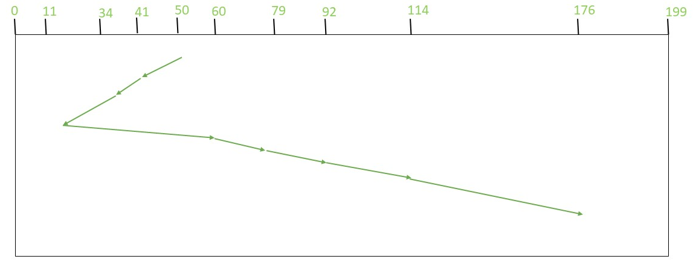
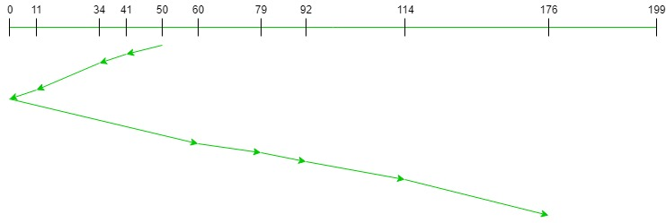
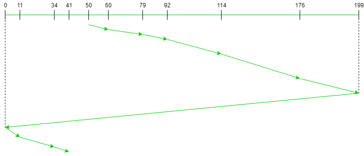

- 디스크 접근 시간

  - **Seek time** + rotational delay + transfer time
  - 탐색 시간 (seek time) 이 가장 크다.
  - [rotational delay](https://www.seagate.com/tech-insights/choosing-high-performance-storage-is-not-about-rpm-anymore-master-ti/#:~:text=But%20today's%20most%20common%20RPM,than%20the%205400%20RPM%20drive.) (rpm) 은 매우 빠르다.

- 다중 프로그래밍 환경

  - 디스크 큐(disk queue)에는 많은 요청(request)들이 쌓여있다.
  - 요청들을 어떻게 처리하면 **탐색 시간(seek time)** 을 줄일 수 있을까? (Disk 헤더를 적게 움직이자.)

- 디스크 스케쥴링 알고리즘
  - FCFS (First-Come Fisrt-Served)
  - SSTF (Shortest Seek Time First)

## FCFS Disk Scheduling Algorithm

Request sequence = {176, 79, 34, 60, 92, 11, 41, 114}

Initial head position = 50

- FCFS: First-Come First-Served
- Simple and fair
- 효율적이지 않다.

## SSTF Disk Scheduling Algorithm

Request sequence = {176, 79, 34, 60, 92, 11, 41, 114}

Initial head position = 50

- Shortest seek time first: Select the request with the minimum seek time from the current head position
- Starvation
- **Not Optimal**

## SCAN Disk Scheduling Algorithm

Request sequence = {176, 79, 34, 60, 92, 11, 41, 114}

Initial head position = 50

Direction = left (We are moving from right to left)

- The head continuously scans back and forth across the disk
- Elevator Algorithm 이라고 부르기도 한다.
- 밑에서 SCAN Variants (스캔 변종) 을 살펴보자

## C-SCAN Disk Scheduling Algorithm

Request sequence = {176, 79, 34, 60, 92, 11, 41, 114}

Initial head position = 50

- C 는 Circular 를 의미한다.
- Request 들은 실제로 균일하게(uniform) 분포해있다는 것을 생각해, SCAN 알고리즘의 비효율성을 고려해 만든 방법이다.
- 헤드가 끝까지 갔다가 다시 반대쪽 끝으로 움직여서, 헤드를 가지고 스캔하는 부분을 중복 없이 처리하게 한다. 왜냐면 만약에 176으로 가서 바로 41을 간다면 방금 처리한 50 - 176 부분을 한 번더 처리하게 되니 비효율적인 것이다.
- 거리로는 많아질 수 있어도 끝에서 끝까지 이동하는 작업이 Seek Job 이 아니기 때문에 어려운 일은 아니다.

## LOOK Disk Scheduling Algorithm

Request sequence = {176, 79, 34, 60, 92, 11, 41, 114}

Initial head position = 50

Direction = right (We are moving from left to right)

- SCAN 알고리즘의 비효율성을 고려한 방법이다. 굳이 헤드를 끝까지 움직이지 않고 Request Queue 를 보고 끝까지 가는 것이다.

## C-LOOK Disk Scheduling Algorithm

Request sequence = {176, 79, 34, 60, 92, 11, 41, 114}

Initial head position = 50

Direction = right (Moving from left to right)

- C-SCAN + LOOK 을 결합한 것이다.

## References

http://www.kocw.net/home/search/kemView.do?kemId=978503

http://contents.kocw.or.kr/KOCW/document/2013/kyungsung/yangheejae/os06.pdf

https://www.geeksforgeeks.org/fcfs-disk-scheduling-algorithms/

https://www.geeksforgeeks.org/program-for-sstf-disk-scheduling-algorithm/

https://www.geeksforgeeks.org/scan-elevator-disk-scheduling-algorithms/?ref=lbp

https://www.geeksforgeeks.org/c-scan-disk-scheduling-algorithm/

https://www.geeksforgeeks.org/look-disk-scheduling-algorithm/?ref=lbp

https://www.geeksforgeeks.org/c-look-disk-scheduling-algorithm/?ref=lbp
