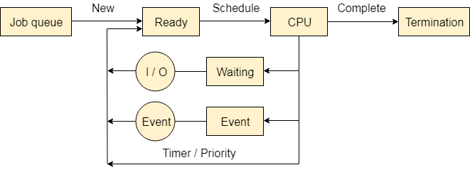

Process mangement 안에 Queue, PCB 같은 것이 저장된다.

## Job Queue

- Job scheduler
- Long-term scheduler

Hard disk 안에 있는 job 들이 Main memory 에 올라가기 위해 기다리고 있는 곳이다.

"new" or "created" 상태의 process 가 Job scheduler 에 의해 ready 상태가 되기 위해 기다리는 곳이다.

job scheduler 는 long-term scheduler 라고도 부른다. 그 이유는 memory 에 process 를 올릴 것을 기다리는 queue 인데, memory 가 꽉차있다면 Scheduler 가 돌아가지 않는다. 즉 Process 가 완전히 끝나야 Scheduling 이 일어나기 때문에 Long-term-scheduler 라고 불린다.

자주 이용되지 않는 프로그램이기 때문에 복잡한 알고리즘으로 프로그래밍 된다.

## Ready Queue

- CPU scheduler
- Short-term scheduler

ready queue 란, ready 상태의 process 가 실행을 위해 short-term-scheduler 에 의해 선택 되기를 기다리는 곳이다. short-term 인 이유는 빠르게 context switching 이 일어나야 동시에 많은 프로그램을 실행할 수 있기 때문이다.

## Device Queue

- Device scheduler

device queue 란, Disk, Printer 와 같은 Task 들이 Disk scheduler, Print scheduler 와 같은 스케쥴러에 의해 실행되기 위해 기다리는 queue 다.

## References

http://www.kocw.net/home/search/kemView.do?kemId=978503
